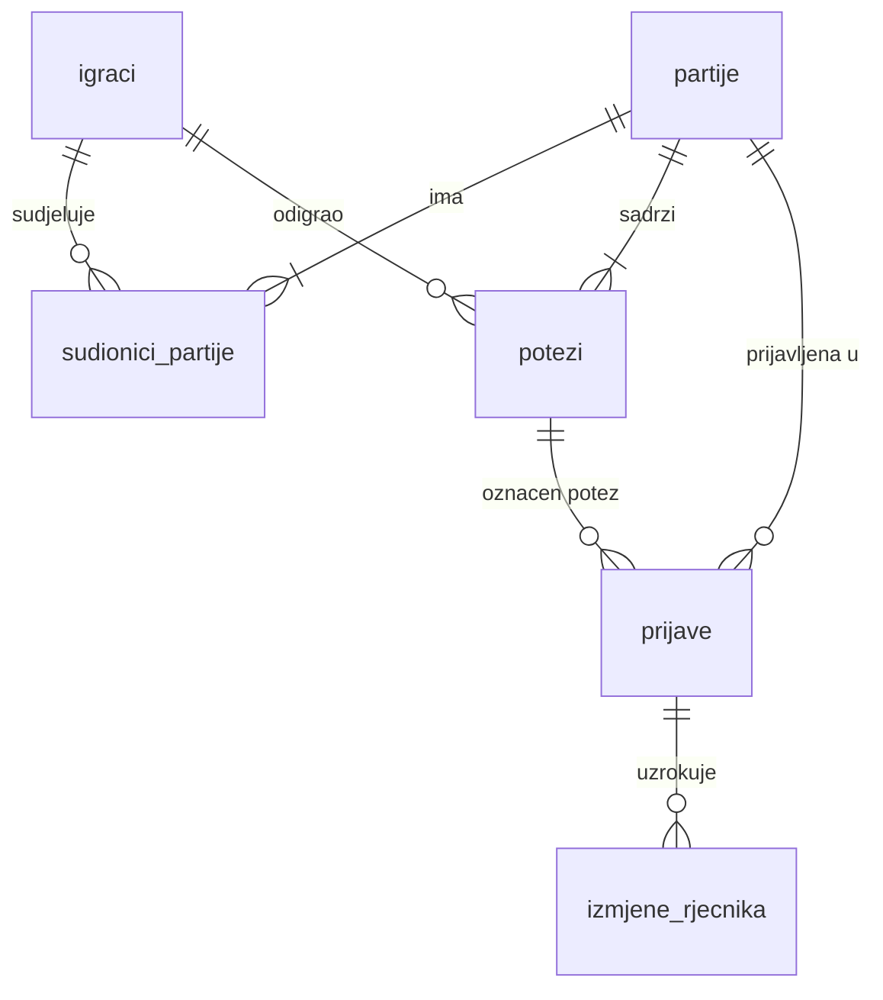

# Model podataka

Sve tablice i stupci imenuju se hrvatski, bez dijakritika, u `snake_case`. Migracije vodi Drizzle.

## igraci

Jedinstvena tablica za goste, registrirane i administratore. Registracija gosta je `UPDATE` istog retka — statistika ostaje.

| Stupac | Tip | Opis |
|---|---|---|
| id | uuid PK | Trajni identitet (gost ga čuva u localStorage) |
| vrsta | enum: `gost`, `registriran`, `admin` | |
| nadimak | text | Generiran za goste (npr. VeseliJež42); jedinstven za registrirane |
| avatar_id | smallint | 0–7, jedan od 8 predefiniranih avatara; nasumično dodijeljen pri stvaranju, promjenjivo samo za registrirane |
| email | text, null | Samo registrirani; jedinstven |
| lozinka_hash | text, null | argon2id |
| email_potvrdjen | boolean | |
| odigrane | integer | Agregat (izvor istine: `sudionici_partije`) |
| pobjede | integer | Agregat |
| eliminacije_ukupno | integer | Agregat |
| bodovi_ukupno | integer | Agregat |
| stvoren | timestamptz | |
| zadnja_aktivnost | timestamptz | Za čišćenje starih gostiju |

Agregati se ažuriraju **transakcijski** pri završetku partije, u istoj transakciji sa zapisom rezultata. Uvijek su izračunljivi ponovno iz `sudionici_partije` (skripta za rekonstrukciju).

## partije

| Stupac | Tip | Opis |
|---|---|---|
| id | uuid PK | |
| pocetak | timestamptz | |
| kraj | timestamptz, null | |
| status | enum: `u_tijeku`, `zavrsena`, `ponistena` | `ponistena` je rezerva za tehničke incidente |
| pobjednik_id | uuid FK → igraci, null | |

## sudionici_partije

Rezultat svakog igrača u svakoj partiji — **temelj svih statistika i budućeg matchmakinga**.

| Stupac | Tip | Opis |
|---|---|---|
| partija_id | uuid FK | PK (partija_id, igrac_id) |
| igrac_id | uuid FK | |
| sjedalo | smallint | 0–3, nasumično dodijeljeno |
| plasman | smallint, null | 1–4; null dok partija traje |
| bodovi | smallint | Plasman + eliminacije + bonus |
| eliminacije | smallint | Koliko je protivnika izbacio |
| nacin_ispadanja | enum, null | `ne_znam`, `istek`, `mrtva_slova`, `prekid`, `pobjednik`, `kaladont` |
| cekanje_ms | integer | Vrijeme provedeno u redu čekanja (za prosjek zadnjih 100 partija) |

## potezi

Potpuna povijest — pogoni prikaz povijesti, prijave grešaka i buduće analize.

| Stupac | Tip | Opis |
|---|---|---|
| id | bigint PK (identity) | |
| partija_id | uuid FK | indeksirano |
| runda | smallint | Raste nakon svake eliminacije |
| redni_broj | smallint | Redoslijed unutar partije |
| igrac_id | uuid FK, null | null = sustavski potez ako ga bude u budućnosti; Kaladont više ne stvara sustavski potez |
| vrsta | enum: `rijec`, `ne_znam`, `istek`, `prekid`, `auto_kraj`, `kaladont`, `sustav_rijec` | `auto_kraj` = eliminacija mrtvim slovima; `kaladont` = eliminacija posebnim pravilom; `sustav_rijec` je rezervirano za budući sustavski potez |
| rijec | text, null | Samo za vrstu `rijec` |
| trazena_slova | text, null | Dva grafema koja su vrijedila za ovaj potez |
| trajanje_ms | integer | Vrijeme razmišljanja (i signal za detekciju botova) |
| vrijeme | timestamptz | |

Neuspjeli pokušaji (odbijene riječi) se **ne** zapisuju u `potezi` — samo prolaze kroz validaciju; brojač odbijenih po potezu može se dodati kasnije bude li potreban.

## rijeci

| Stupac | Tip | Opis |
|---|---|---|
| rijec | text PK | Mala slova, s dijakriticima |
| prva_dva | text | Prva dva **grafema** (predizračunato pri uvozu) |
| zadnja_dva | text | Zadnja dva **grafema** |
| vrste | text[] | Kategorije oblika (imenica, glagol, pridjev…) — oblik može imati više ([ADR-013](odluke/013-sve-vrste-rijeci-leksemske-grupe.md)) |
| grupe | text[] | Leksemske grupe `vrsta:lema[:stupanj]` — potrošnja ponavljanja u partiji |
| frekvencija | integer | Iz hrWaC korpusa (informativno) |
| aktivna | boolean | Soft-delete: uklonjene riječi ostaju radi povijesti |
| dodana | timestamptz | |
| napomena | text, null | Npr. „iznimka digrafa", „dodana iz prijave #12" |

Indeksi: `(prva_dva) WHERE aktivna` (traženje nastavaka), `(zadnja_dva) WHERE aktivna` (analiza klopki).

## prijave

| Stupac | Tip | Opis |
|---|---|---|
| id | integer PK (identity) | |
| partija_id | uuid FK | Prijava uvijek referencira partiju |
| potez_id | bigint FK, null | Točan potez na kojem je uočena greška |
| igrac_id | uuid FK | Tko prijavljuje |
| poruka | text | Slobodan opis igrača |
| status | enum: `nova`, `pregledana`, `rijesena` | |
| vrijeme | timestamptz | |
| rijesio_id | uuid FK, null | Admin |
| napomena_admina | text, null | |

Prijava ne nosi snapshot — **povijest partije već je trajna** u `potezi`, pa admin pregledava stvarne podatke.

## izmjene_rjecnika

Revizijski trag **ručnih** promjena rječnika. Masovni uvoz se ne bilježi ovdje (milijun redaka bez informacijske vrijednosti — ADR-013) nego sažetkom u izvještaju uvoza.

| Stupac | Tip | Opis |
|---|---|---|
| id | integer PK (identity) | |
| rijec | text | |
| akcija | enum: `dodana`, `uklonjena`, `vracena` | |
| razlog | text | |
| prijava_id | integer FK, null | Ako je izmjena potekla iz prijave |
| admin_id | uuid FK, null | null = skripta uvoza |
| vrijeme | timestamptz | |

## Izvedeni podaci (bez tablica)

- **Mrtvi parovi:** izvode se pri učitavanju rječnika u memoriju (kombinacije bez riječi) — ne pohranjuju se.
- **Prosjek čekanja zadnjih 100 partija:** upit nad `sudionici_partije.cekanje_ms` za zadnjih 100 završenih partija; keširano u memoriji poslužitelja, osvježava se pri svakom početku partije.
- **Rang:** računa se pri prikazu iz agregata (`bodovi_ukupno / odigrane`), nikad se ne pohranjuje — promjena pragova ne traži migraciju.
- **Border:** izveden 1:1 iz trenutnog ranga (vidi [vizualni-identitet.md](../05-ux-ui/vizualni-identitet.md#avatari-i-borderi)); nema vlastiti stupac, korisnik ga ne bira.
- **Top riječi:** `GET /rijeci/top` grupira `potezi.rijec` (COUNT, GROUP BY) preko svih partija — stvarna učestalost igranja, različito od statičke `rijeci.frekvencija` (korpusni uvoz). Računa se na zahtjev, bez keširanja u v1.
