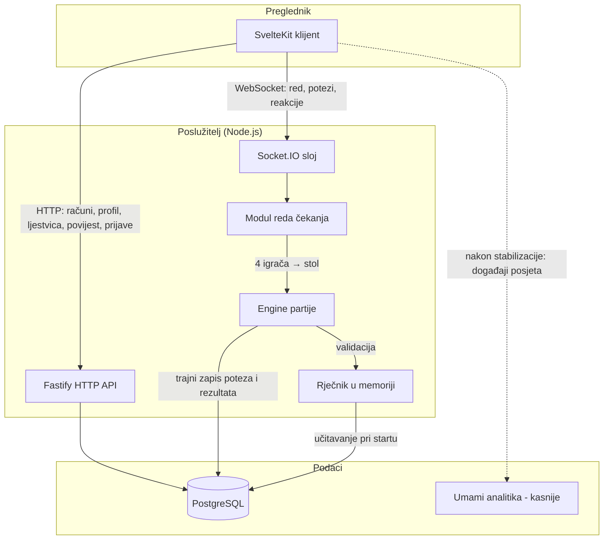

# Pregled arhitekture

## Načela

1. **Poslužitelj je jedini autoritet.** Klijent ništa ne presuđuje — svaka riječ, timer i eliminacija validiraju se na poslužitelju. Klijentski prikazi (timer, slova) su informativni.
2. **Logika igre je čista i dijeljena.** Pravila (grafemi, validacija, bodovanje) žive u paketu `zajednicko` bez ovisnosti o mreži i bazi — zato su trivijalno testabilna i koristi ih i klijent (trenutačne povratne informacije) i poslužitelj (presuda).
3. **Skromno, ali spremno za rast.** Jedan proces poslužitelja i red čekanja u memoriji dostaju MVP-u; sučelja (strategija uparivanja, repozitoriji) postavljena su tako da se Redis/više procesa dodaju bez prepravljanja.

## Komponente

## Podjela odgovornosti

| Komponenta                      | Odgovornost                                                                                                                                                                     |
| ------------------------------- | ------------------------------------------------------------------------------------------------------------------------------------------------------------------------------- |
| **SvelteKit klijent**           | Prikaz ekrana, upis riječi, prikaz stanja primljenog socketima; SSR za landing/ljestvicu (SEO)                                                                                  |
| **Fastify HTTP API**            | Registracija/prijava, profil, ljestvica, povijest partija, podnošenje prijava, admin                                                                                            |
| **Socket.IO sloj**              | Autentikacija veze (gost token / sesija), sobe po partiji, isporuka događaja                                                                                                    |
| **Modul reda čekanja**          | Red u memoriji; strategija uparivanja (MVP: prva 4); emitiranje stanja reda s imenima i prosjekom čekanja                                                                       |
| **Engine partije**              | Stanje stola, potezi, timeri (30 s), eliminacije, bodovi; koristi pravila iz `zajednicko`                                                                                       |
| **Rječnik u memoriji**          | `Map<prvaDva, Set<rijec>>` + skup svih riječi; mrtvi parovi; učitava se pri startu, osvježava signalom                                                                          |
| **PostgreSQL**                  | Trajni podaci: igrači, partije, potezi, riječi, prijave, izmjene rječnika                                                                                                       |
| **Umami (nakon stabilizacije)** | Opcionalna anonimna analitika posjeta (self-hosted, bez kolačića); nije dio početnog produkcijskog stacka ni uvjet lansiranja ([ADR-014](odluke/014-operativni-model-mvp-a.md)) |

## Ključni tokovi

### Potez

1. Klijent šalje `potez:rijec` sa riječju.
2. Engine provjerava: igrač na potezu → riječ valjana (rječnik, prefiks, neiskorištena) → upis poteza u bazu.
3. Engine odmah provjerava **dostupnost nastavka** za nova zadnja dva grafema; ako nastavka nema, sljedeći igrač automatski ispada (RS-02/RS-03).
4. Svim igračima u sobi emitira se novo stanje; timer sljedećeg poteza kreće na poslužitelju.

### Rječnik u memoriji

Baza je izvor istine, ali igra ne pita bazu ni za jedan potez: pri startu se `rijeci WHERE aktivna` učita u strukture u memoriji (≈ 1,2 milijuna oblika s leksemskim grupama, ~150–200 MB — ADR-013). Validacija je O(1), a dostupnost nastavka provjerava se po grupama unutar prefiksa.

## Skaliranje (poslije MVP-a)

- Više procesa: Socket.IO Redis adapter + red čekanja u Redisu (strategija uparivanja ostaje ista).
- Rang-uparivanje: nova strategija u modulu reda; podaci već postoje (vidi [model-podataka.md](model-podataka.md)).
- Baza dugoročno: particioniranje tablice `potezi` po partijama; agregati se ne mijenjaju.
