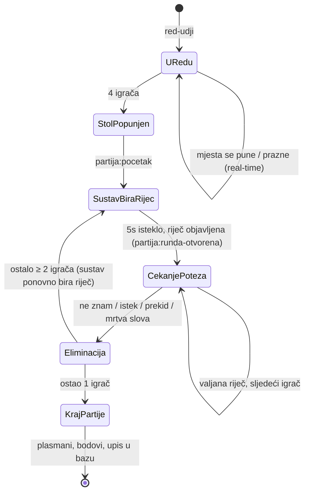
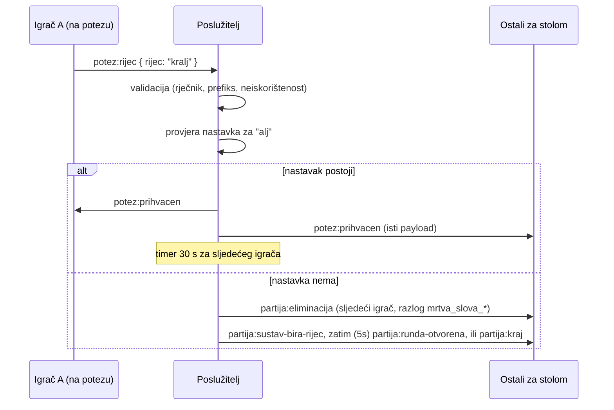

# Životni ciklus partije

## Dijagram stanja

Napomene:

- **SustavBiraRijec:** traje 5 sekundi; nitko ne može igrati. Server nasumično bira valjanu riječ sa slobodnim nastavkom (`nasumicnaValjanaRijec`) - i za 1. rundu partije i nakon svake eliminacije/kaladont-efekta (RS-01). Klijent prikazuje obrazloženje zadnje eliminacije (ako postoji) i brojač. 30-sekundni timer poteza kreće tek kad ovo stanje završi.
- **Mrtva slova** eliminiraju sljedećeg igrača trenutno, bez ulaska u njegovo `CekanjePoteza` (RS-02/RS-03).
- Eliminirani igrač prelazi u ulogu **promatrača** istog stola do `KrajPartije`.

## Slijed poruka za tipičan potez

## Timeri

- Jedini mjerodavni timer je na poslužitelju; 30s timer poteza pokreće se u trenutku emitiranja `potez:prihvacen` / `partija:runda-otvorena` (ne dok sustav bira riječ).
- Klijent dobiva apsolutni `istekPotezaIso` pa ni kašnjenje mreže ne pomiče prikaz.
- Istek na poslužitelju okida eliminaciju čak i ako klijent šuti (zatvoren laptop, ugašen tab).

## Kraj partije — transakcija

U jednoj transakciji: upis `plasman/bodovi/eliminacije/nacin_ispadanja` u `sudionici_partije` → ažuriranje agregata u `igraci` → status partije `zavrsena`. Tek potom se emitira `partija:kraj`. Time podaci u bazi nikad ne zaostaju za onim što su igrači vidjeli.
