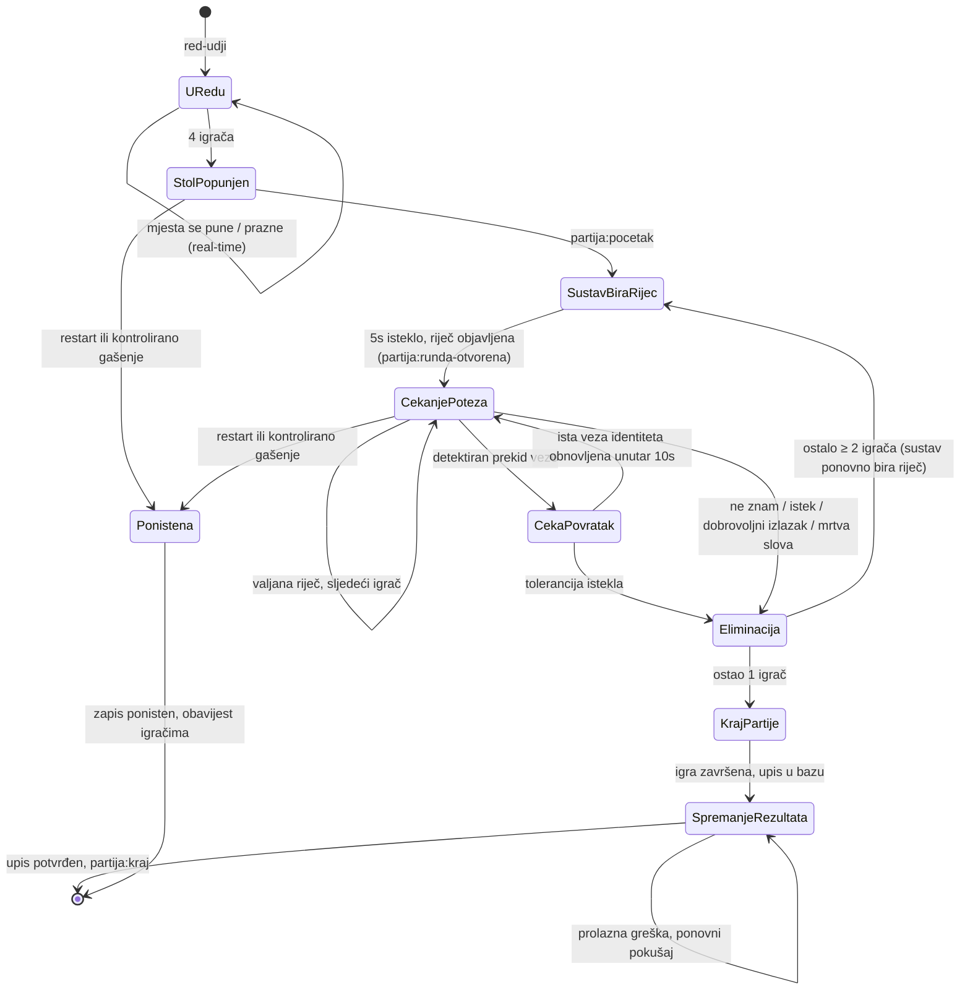

# Životni ciklus partije

## Dijagram stanja

Napomene:

- **SustavBiraRijec:** traje 10 sekundi; nitko ne može igrati. Server prvo nasumično bira iz skupa sigurnih riječi uz aktualne kategorije i potrošene grupe, a zatim po potrebi koristi rezervni odabir riječi sa slobodnim nastavkom. Isti tok vrijedi za 1. rundu partije i nakon svake eliminacije/kaladont-efekta (RS-01). Klijent prikazuje obrazloženje zadnje eliminacije (ako postoji) i brojač. 30-sekundni timer poteza kreće tek kad ovo stanje završi.
- **Mrtva slova** eliminiraju sljedećeg igrača trenutno, bez ulaska u njegovo `CekanjePoteza` (RS-02/RS-03).
- **CekaPovratak:** mrežni prekid pokreće 10-sekundnu toleranciju samo za prekinutog igrača. Timer poteza ne pauzira se; istek poteza ima prednost ako nastupi prije isteka tolerancije. Dobrovoljni izlazak ne ulazi u ovo stanje.
- Eliminirani igrač prelazi u ulogu **promatrača** istog stola do `KrajPartije`.

## Slijed poruka za tipičan potez

## Timeri

- Jedini mjerodavni timer je na poslužitelju; 30s timer poteza pokreće se u trenutku emitiranja `potez:prihvacen` / `partija:runda-otvorena` (ne dok sustav bira riječ).
- Klijent dobiva apsolutni `istekPotezaIso` pa ni kašnjenje mreže ne pomiče prikaz.
- Istek na poslužitelju okida eliminaciju čak i ako klijent šuti ili je privremeno odspojen. Ponovno spajanje ne resetira niti pomiče `istekPotezaIso`.

## Kraj partije — transakcija

Završetak igre i spremanje rezultata su dva odvojena stanja. Motor prvo zaustavlja poteze i računa konačne plasmane, ali zadržava partiju u memoriji sa statusom `spremanje_rezultata`. Dok traje prolazni problem s bazom, ponavlja isti završni upis s eksponencijalnim odmakom i igračima šalje `partija:spremanje-rezultata`.

U jednoj transakciji: upis `plasman/bodovi/eliminacije/iskustvo/nacin_ispadanja` u `sudionici_partije` → ažuriranje agregata u `igraci`, uključujući trajni XP → status partije `zavrsena`. Završni upis mora biti idempotentan za isti `partijaId`, jer pokušaj može biti ponovljen nakon prekida veze s bazom. Tek nakon potvrđene transakcije motor sprema personalizirane rezultate, emitira `partija:kraj`, zatvara privatnu sobu i zakazuje brisanje memorijskog stanja.

`partija:kraj` je potvrda da su rezultati trajno spremljeni, a ne samo da je igra završila. Oporavak vrijedi dok proces radi; otpornost na restart procesa zahtijevala bi trajni outbox.

## Restart i kontrolirano gašenje

Pri podizanju poslužitelja svi redovi `partije` sa statusom `u_tijeku` prelaze u `ponistena`. To su partije čije je memorijsko stanje izgubljeno restartom i ne smiju ponovno izgledati kao aktivne.

Pri `SIGTERM`/`SIGINT` poslužitelj prvo prestaje prihvaćati nova uparivanja i pokretanja privatnih partija, zatim aktivnim klijentima šalje `partija:ponistena`, označava njihove zapise kao `ponistena`, zaustavlja timere i tek onda zatvara Socket.IO/HTTP poslužitelj. Igrač dobiva jasnu poruku da rezultat nije dodijeljen i može se vratiti na naslovnicu.

Igrač eliminiran bez dobrovoljnog izlaska može prije toga dobiti privatni `iskustvo:obracun` za konačne poteze i streak; taj prikaz ne obavlja isplatu. Stvarni zapis XP-a ostaje dio završne transakcije, pa se ne može dodijeliti dvaput reconnectom.
