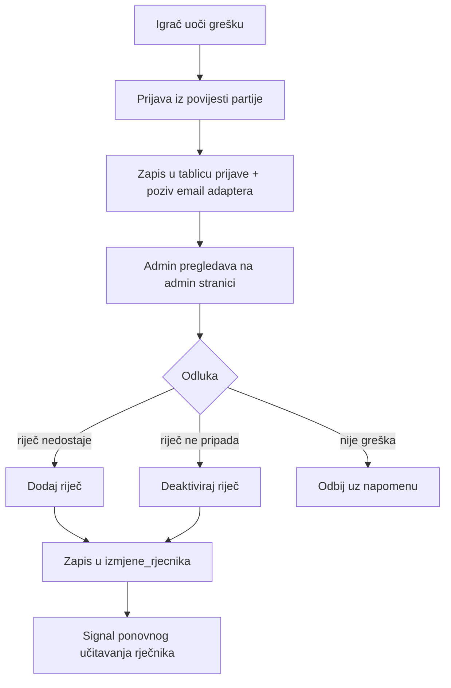

# Održavanje rječnika

Rječnik na startu **nije savršen** i to je svjesna odluka: umjesto nemoguće savršene baze, gradimo **petlju povratnih informacija** s igračima. Kvaliteta rječnika je proizvod zajednice.

## Petlja povratnih informacija

## Prijava riječi (perspektiva igrača)

1. Igrač otvori **povijest partije** (dostupna tijekom i nakon igre).
2. Označi konkretan potez i napiše kratku poruku (npr. „riječ 'aljkavost' postoji, a nije prihvaćena").
3. Prijava se sprema sa statusom `nova` i vezom na završenu partiju i potez; igrač može prijaviti najviše tri različite riječi po partiji. Email adapter se poziva best-effort nakon spremanja.
4. Nakon klika gumb prelazi u stanje „Riječ je prijavljena"; ponovni klik na istu riječ nije dopušten.

Tipični povodi prijave:

| Situacija                                          | Vjerojatan uzrok                                 |
| -------------------------------------------------- | ------------------------------------------------ |
| „U bazi nemamo riječ na 'XY'", a igrač zna riječ   | Riječ nedostaje (filtar uvoza ili nije u hrLexu) |
| Prihvaćena riječ koja ne postoji                   | Šum web-korpusa (tipfeler u hrWaC-u)             |
| Riječ odbijena kao kriva slova, a igrač je siguran | Kandidat za iznimku digrafa                      |

## Admin stranica (perspektiva admina)

- Popis prijava s filtrima po statusu (`nova` / `pregledana` / `rijesena`), uz svaku prikaz povijesti partije s **označenim spornim potezom**.
- Akcije: dodaj riječ (uz automatski izračun grafema i **obaveznu vrstu riječi**; leksemska grupa se izvodi iz vrste i leme), deaktiviraj riječ, dodaj iznimku digrafa, odbij prijavu — sve uz obaveznu napomenu.
- Svaka akcija zapisuje se u `izmjene_rjecnika` (tko, kada, zašto, iz koje prijave).

### Trenutačni administrativni put

Admin stranica i rute koriste stvarnu sesiju registriranog računa s `vrsta = 'admin'`; privremeni `X-Admin-Kljuc` više nije aktivni model autentikacije. Ruta za izmjenu odmah osvježava rječnik u memoriji (`ponovoUcitaj()`), pa nije potreban restart poslužitelja.

Prije produkcije još treba implementirati jednokratni CLI koji već registriranom i potvrđenom računu sigurno dodjeljuje prvu admin ulogu. Dok taj CLI ne postoji, ručni SQL ostaje poznato lokalno ograničenje i **nije odobren produkcijski postupak**. Dodavanje iznimke digrafa također još nije potpuna live admin akcija: iznimke su dio verzioniranog koda i zahtijevaju PR, test i redeploy.

## Pravila izmjena

1. **Soft-delete:** riječi se nikad ne brišu, samo deaktiviraju (`aktivna = false`) — povijest odigranih partija ostaje razumljiva.
2. **Primjena na aktivne partije:** izmjena rječnika ne mijenja već prihvaćene poteze, ali može utjecati na buduće validacije u aktivnim partijama nakon reloada.
3. **Ponovno učitavanje:** izmjene postaju važeće signalom za reload zajedničkog rječnika u memoriji.
4. **Iznimke digrafa** dodane kroz prijave zahtijevaju ponovni izračun `prva_dva`/`zadnja_dva` samo za tu riječ.

## Ciljevi kvalitete (pratiti od lansiranja)

- Broj prijava po 100 partija — očekivani pad kroz vrijeme.
- Vrijeme od prijave do rješenja — cilj < 48 h dok je projekt malen.
- Omjer prihvaćenih i odbijenih prijava — kalibrira povjerenje u bazu.
