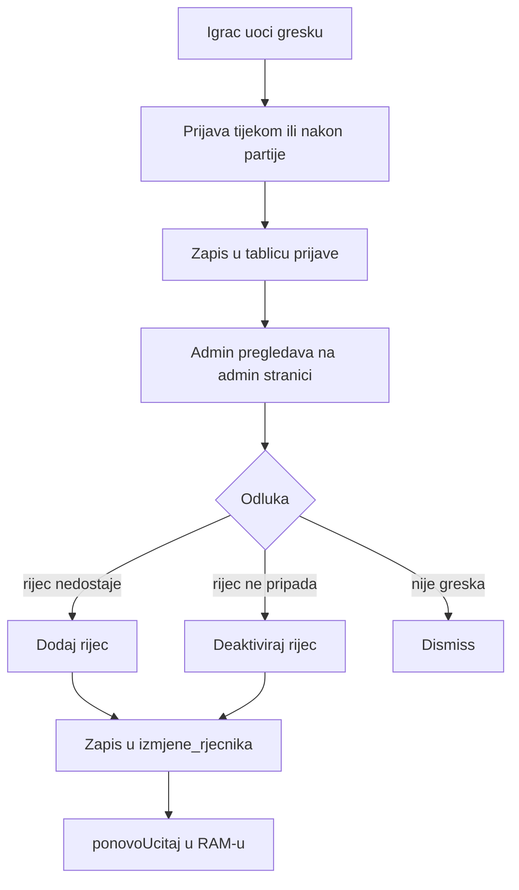

# Održavanje rječnika

Rječnik na startu **nije savršen** i to je svjesna odluka: umjesto nemoguće savršene baze, gradimo **petlju povratnih informacija** s igračima. Kvaliteta rječnika je proizvod zajednice.

## Petlja povratnih informacija

```mermaid
flowchart TD
    A[Igrac uoci gresku] --> B[Prijava tijekom ili nakon partije]
    B --> C[Zapis u tablicu prijave]
    C --> D[Admin pregledava na admin stranici]
    D --> E{Odluka}
    E -- rijec nedostaje --> F[Dodaj rijec]
    E -- rijec ne pripada --> G[Deaktiviraj rijec]
    E -- nije greska --> H[Dismiss]
    F --> I[Zapis u izmjene_rjecnika]
    G --> I
    I --> J[ponovoUcitaj u RAM-u]
```

## Prijava riječi (perspektiva igrača)

1. Igrač otvori panel **Prijavi riječ** (dostupan tijekom i nakon partije, ispod zone igre).
2. Mini toggle: **Odigrane** (prihvaćene riječi → admin može obrisati) ili **Moje odbijene** (vlastite `RIJEC_NE_POSTOJI` → admin može dodati).
3. Limit **3 + 3** po partiji (odvojeno po tipu). Nema poruke ni emaila; lokalna zelena potvrda.
4. Nakon klika gumb prelazi u „Prijavljeno”; ponovni klik nije dopušten.

Tipični povodi prijave:

| Situacija                                          | Tip prijave     | Admin akcija |
| -------------------------------------------------- | --------------- | ------------ |
| Prihvaćena riječ koja ne postoji                   | `za_brisanje`   | Obriši       |
| Odbijena riječ koja bi trebala proći               | `za_dodavanje`  | Dodaj        |

## Admin stranica (perspektiva admina)

- Tri reda: riječi za brisanje, riječi za dodavanje, računi s pogrdnim nadimkom.
- Jedan klik: **Obriši** / **Dodaj** / **Dismiss** (riječi); **Obriši račun** / **Pusti** (igrači).
- Jedan-klik **Dodaj** koristi default vrstu `imenica`; ručni obrazac i dalje bira vrstu.
- Ručni rječnik: tabovi Ručno / Izmjene / Test / Čišćenje; pretraga, deaktivacija/vraćanje, dodavanje s obaveznom vrstom; masovno soft-brisanje aktivnih nstandardnih oblika (q/w/x/y i ostalo izvan hrvatske abecede).
- Nakon izmjene `ponovoUcitaj()` osvježava RAM — aktivne partije odmah vide novu validaciju za buduće poteze. Restart nije potreban.
- Bez email obavijesti; admin se ulogira i pregleda.

### Trenutačni administrativni put

Admin stranica i rute koriste stvarnu sesiju registriranog računa s `vrsta = 'admin'`.

Prije produkcije još treba implementirati jednokratni CLI koji već registriranom i potvrđenom računu sigurno dodjeljuje prvu admin ulogu. Dodavanje iznimke digrafa i dalje zahtijeva PR i redeploy.

## Pravila izmjena

1. **Soft-delete:** riječi se nikad ne brišu, samo deaktiviraju (`aktivna = false`) — povijest odigranih partija ostaje razumljiva.
2. **Primjena na aktivne partije:** izmjena rječnika ne mijenja već prihvaćene poteze, ali može utjecati na buduće validacije u aktivnim partijama nakon reloada.
3. **Ponovno učitavanje:** izmjene postaju važeće signalom za reload zajedničkog rječnika u memoriji.
4. **Iznimke digrafa** dodane kroz prijave zahtijevaju ponovni izračun `prva_dva`/`zadnja_dva` samo za tu riječ.

## Ciljevi kvalitete (pratiti od lansiranja)

- Broj prijava po 100 partija — očekivani pad kroz vrijeme.
- Vrijeme od prijave do rješenja — cilj < 48 h dok je projekt malen.
- Omjer prihvaćenih i odbijenih prijava — kalibrira povjerenje u bazu.
