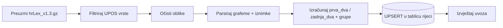

# Uvoz rječnika

Skripta `skripte/uvoz-rjecnika` pretvara hrLex u tablicu `rijeci`. Uvoz je **idempotentan** (ponovno pokretanje ne duplicira) i ispisuje statistiku za ljudsku provjeru.

## Cjevovod

### 1. Preuzimanje

- URL: `https://www.clarin.si/repository/xmlui/bitstream/handle/11356/1232/hrLex_v1.3.gz`
- Provjera MD5: `e55a21f10bbb4f6c22afe31a65803649`
- Datoteka se kešira lokalno u `skripte/uvoz-rjecnika/podaci/` (folder je u `.gitignore` — vidi ADR-010).

### 2. Filtar vrsta riječi (UPOS)

hrLex je TSV: `oblik, lema, MSD, MSD-obiljezja, UPOS, UD-obiljezja, frekvencija, frekvencija-na-milijun`.

Od [ADR-013](../03-arhitektura/odluke/013-sve-vrste-rijeci-leksemske-grupe.md) uvoze se **sve vrste riječi u svim oblicima**. Filtrira se po UPOS stupcu:

| UPOS | Kategorija u igri |
|---|---|
| NOUN | imenica |
| VERB, AUX | glagol |
| ADJ | pridjev |
| ADV | prilog |
| PRON, DET | zamjenica |
| NUM | broj (rimski brojevi — `NumForm=Roman` — otpadaju) |
| ADP | prijedlog |
| CCONJ, SCONJ | veznik |
| PART | čestica |
| INTJ | uzvik |
| PROPN, X, SYM, PUNCT | **otpada** (vlastita imena, strano, simboli) |

Kratice i vlastita imena ne prolaze filtar; interpunkcija i brojke otpadaju i na čišćenju.

### 3. Čišćenje oblika

Odbacuju se oblici koji:

- sadrže bilo što osim malih slova hrvatske abecede (crtice, razmaci, brojke, strana slova poput q/w/x/y),
- počinju velikim slovom (ostaci vlastitih imena),
- imaju manje od **2 grafema** (jednografemske riječi poput „i", „u" ne mogu nikad biti valjan potez),
- su duplikati (isti oblik s više redaka → jedan zapis: frekvencije se zbroje, vrste i grupe se uniraju).

**Bez praga frekvencije** — ulaze svi oblici (odluka u [ADR-005](../03-arhitektura/odluke/005-hrlex-izvor-rjecnika.md)). Frekvencija se sprema informativno.

### 4. Grafemi, iznimke i leksemske grupe

Za svaki oblik: pohlepno parsiranje digrafa (dž, lj, nj) uz **listu iznimaka** (injekcija, konjunkcija…) koja živi u `paketi/zajednicko` — ista logika koju koristi igra. Rezultat su stupci `prva_dva` i `zadnja_dva` (vidi [digrafi-i-grafemi.md](../02-pravila-igre/digrafi-i-grafemi.md)).

Uz to se za svaki redak izračunava **ključ leksemske grupe** iz leme: `vrsta:lema`, a za pridjeve i priloge `vrsta:lema:stupanj` (stupanj iz `Degree=Cmp/Sup`, inače pozitiv). Oblik koji pripada većem broju kategorija dobiva **uniju** grupa u stupcu `grupe` (vidi [pravila-igre.md](../02-pravila-igre/pravila-igre.md#leksemske-grupe-zabrana-ponavljanja)).

Pri učitavanju u memoriju poslužitelj iz tih grupa izvodi zaseban pool za otvaranje runde: aktivne oblike s grupom `imenica:<riječ>` i manje od 6 znakova. To su imeničke leme u nominativu; pool se ne sprema u zasebnu tablicu niti ograničava valjanost poteza igrača.

### 5. Upis u bazu

- **Grupni UPSERT** (chunkovi po ~1000 redaka unutar transakcija) — 1,2 milijuna oblika mora proći u minutama, ne satima.
- `INSERT ... ON CONFLICT (rijec) DO UPDATE` ažurira `prva_dva`, `zadnja_dva`, `frekvencija`, `vrste` i `grupe`; postojeće riječi **zadržavaju** `aktivna` status i napomene (ručne izmjene admina preživljavaju ponovni uvoz).
- Masovni uvoz **ne piše** po-riječ retke u `izmjene_rjecnika` (milijun redaka revizije bez informacijske vrijednosti) — bilježi se sažetak u izvještaju uvoza; `izmjene_rjecnika` ostaje revizijski trag **ručnih** izmjena.

### 6. Izvještaj uvoza

Skripta na kraju ispisuje:

- ukupan broj uvezenih oblika i broj odbačenih po razlogu (UPOS, čišćenje, < 2 grafema);
- broj oblika, grupa i lema **po kategoriji** (isti podaci koje igra izlaže na `GET /rjecnik/statistika`);
- distribuciju po frekvenciji — podloga za buduće odluke o kvaliteti;
- broj **mrtvih parova** i popis 20 najčešćih završetaka bez nastavka (sanity check: „nt" mora biti među njima);
- 30 nasumičnih riječi po kategoriji za ljudski pregled.

Ista analiza bez upisa u bazu: `pnpm --filter uvoz-rjecnika analiza` (izvještaj u `podaci/izvjestaj-analize.md`).

## Očekivani red veličine

Analiza od 2026-09-08 (Faza 0, ADR-013): **1.210.660 jedinstvenih oblika** u 141.046 leksemskih grupa — pridjevi ~810 tis., imenice ~213 tis., glagoli ~183 tis., prilozi ~43 tis., ostale kategorije < 1 tis. oblika. Stari filtar (opće imenice u nominativu jednine) davao je ~33 tisuće redaka. Serverske memorijske strukture: ~150–200 MB heapa.
