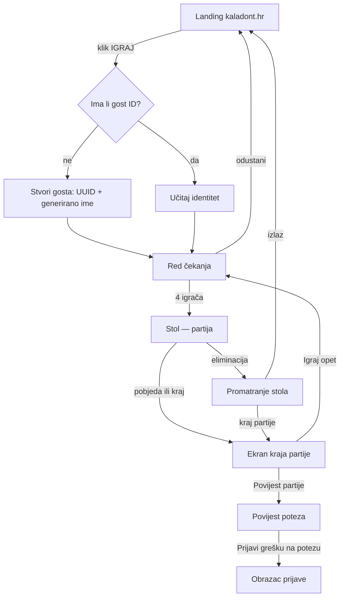
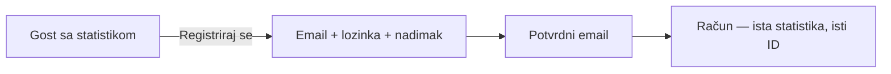
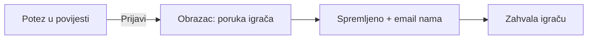

# Tijek korisnika

## Glavni tok: od dolaska do partije (gost)

Ključna svojstva:

- **Jedan klik do reda:** bez lobbyja, bez odabira sobe, bez postavki.
- Gost ID i ime stvaraju se tiho — igrač ne ispunjava ništa.
- „Igraj opet" vraća u red čekanja s istim identitetom.

## Registracija (u bilo kojem trenutku)

- Poziv na registraciju prikazuje se **nakon partije** (najjača motivacija: „Sačuvaj svojih X bodova — registriraj se"), nikad kao prepreka prije igre.
- Registracija je `UPDATE` gostova zapisa — statistika, kalibracija i povijest ostaju (RS-20).
- Prijava na drugom uređaju: standardni email + lozinka.

## Prijava greške

Dostupno svima (i gostima) — prijave su dar, ne privilegija računa.

## Rukovanje prekidima

- Pad veze u **redu čekanja**: mjesto se oslobađa, ostali vide promjenu u real-timeu (RS-16).
- Pad veze u **partiji**: trenutna eliminacija (RS-09/RS-10); po povratku igrač vidi stol kao promatrač s porukom „Veza je pukla — ispao si iz partije."
- Povratak na otvorenu karticu nakon spavanja mobitela: klijent traži `partija:stanje` i obnavlja prikaz iz jedne poruke.
