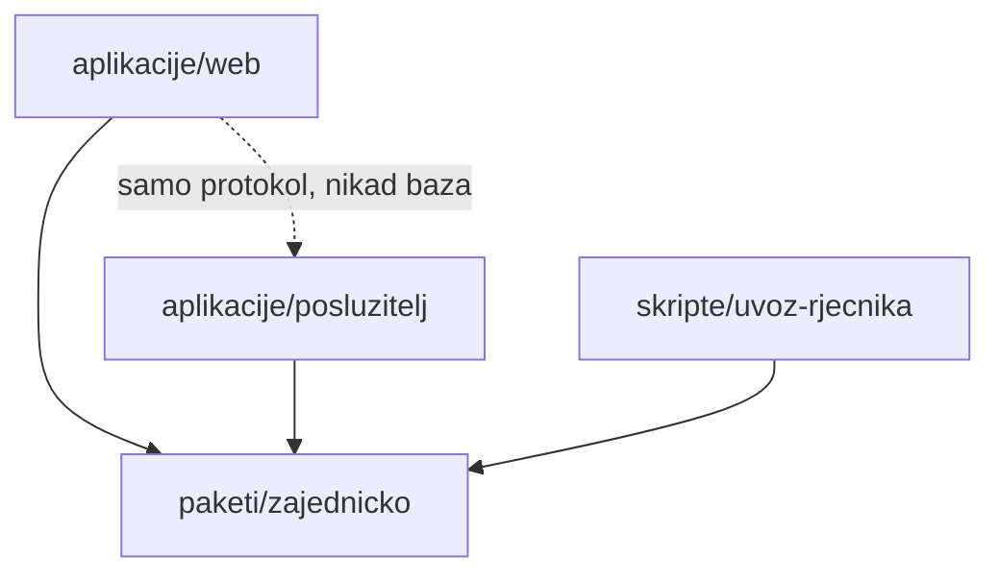

# Struktura repozitorija

Monorepo s pnpm workspaces. Nazivi foldera hrvatski, bez dijakritika.

> **Napomena o statusu:** prikaz ispod opisuje ciljnu logičku strukturu. Aplikacijski paketi postoje, ali operativni artefakti označeni s **planirano u Fazi 8** još nisu implementirani. Stvarno stanje uvijek se provjerava u radnom stablu, ne pretpostavlja iz ovog dijagrama.

```text
kaladont/
├── aplikacije/
│   ├── web/                    # SvelteKit klijent
│   │   └── src/
│   │       ├── routes/         # ekrani: /, /red, /partija/[id], /profil, /ljestvica, /admin...
│   │       └── lib/            # komponente (Stol, Avatar, PrstenTimera...), socket klijent, stanja
│   └── posluzitelj/            # Fastify + Socket.IO
│       └── src/
│           ├── http/           # rute: racuni, profil, ljestvica, povijest, prijave, admin
│           ├── igra/           # engine partije, stol, timeri
│           ├── red/            # red čekanja + strategija uparivanja (sučelje!)
│           ├── rjecnik/        # učitavanje u memoriju, mrtvi parovi, reload signal
│           └── baza/           # Drizzle shema i migracije
├── paketi/
│   └── zajednicko/             # SRCE PRAVILA — bez ovisnosti o mreži i bazi
│       └── src/
│           ├── grafemi.ts      # parsiranje digrafa + lista iznimaka
│           ├── pravila.ts      # validacija poteza, uvjeti eliminacije
│           ├── bodovanje.ts    # plasman + eliminacije + bonus
│           ├── protokol.ts     # tipovi svih Socket.IO poruka
│           └── poruke.ts       # svi UI/serverski tekstovi na hrvatskom (jedno mjesto)
├── skripte/
│   └── uvoz-rjecnika/          # hrLex → Postgres (podaci/ je u .gitignore)
├── docs/                       # ova dokumentacija
├── .github/
│   ├── workflows/              # planirano u Fazi 8: CI, staging i produkcija
│   └── copilot-instructions.md
├── Dockerfile                  # planirano u Fazi 8: runtime + jednokratni alati
├── docker-compose.staging.yml  # planirano u Fazi 8: Caddy + aplikacija + baza
├── docker-compose.prod.yml     # planirano u Fazi 8: Caddy + aplikacija + baza
├── LICENCA.md
└── README.md
```

Planirani operativni artefakti ne smiju se koristiti u uputama kao da već postoje. Njihov ciljani ugovor opisuju [CI/CD](../07-operacije/ci-cd.md), [produkcija i objava](../07-operacije/produkcija-i-objava.md) te [ADR-014](../03-arhitektura/odluke/014-operativni-model-mvp-a.md). Umami se dodaje tek nakon stabilizacije i nije dio početnog produkcijskog Composea.

## Pravila ovisnosti između slojeva



1. `zajednicko` **ne smije** ovisiti ni o čemu iz `aplikacije/` — čista logika, čisti tipovi.
2. Klijent s poslužiteljem komunicira **isključivo** kroz tipove iz `protokol.ts` — nijedan „ad-hoc" event.
3. Svi tekstovi vidljivi korisniku žive u `poruke.ts` — nema stringova rasutih po komponentama (i priprema za buduću višejezičnost).
4. Strategija uparivanja u `red/` je sučelje s MVP implementacijom „prva četvorica" — buduće rang-uparivanje ne dira ostatak sustava (ADR-008).
