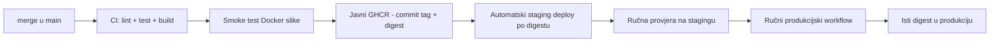

# CI/CD (GitHub Actions)

> **Status 2026-09-16: djelomično implementirano.** `.github/workflows/ci.yml`, `.github/workflows/objavi-ghcr.yml`, `.github/workflows/objavi-staging.yml`, Dockerfile, Compose/Caddy konfiguracije i sintetički CI fixture postoje i provjereni su. Main CI sada pushne candidate, smoke-testira njegov digest, GHCR workflow promovira isti manifest bez rebuilda, a staging workflow automatski objavljuje promovirani digest i provjerava javni health. Produkcijski promotion workflow, backup automatika i deploy ključevi još ne postoje. Ovaj dokument razlikuje stvarni tok od ciljanog budućeg toka.

Tok objave definiran je [ADR-om 014](../03-arhitektura/odluke/014-operativni-model-mvp-a.md):

Razvojno računalo nema virtualizaciju pa se Docker slika ne može testirati lokalno — **CI je jedino mjesto koje dokazuje da slika radi** prije staginga. Zato smoke test nije opcionalan korak nego bloker objave.

## Pravila koja vrijede za sve workflowe

- Sve third-party GitHub Actions reference pinaju se na puni commit SHA; komentar uz SHA navodi čitljivu verziju. Dependabot ih ažurira kroz Pull Request (PR).
- Svaki job dobiva samo nužne `GITHUB_TOKEN` ovlasti. Zadano je `contents: read`; samo job koji objavljuje sliku dobiva `packages: write`.
- Aplikacijska slika gradi se samo za `linux/amd64`. ARM/multi-arch nije dio početne postave.
- Staging i produkcija imaju zasebne GitHub Environmente i SSH ključeve. Produkcijski Environment nema required reviewer jer postoji jedan operater; ručni `workflow_dispatch` jest kontrolna točka.
- `concurrency` dopušta najviše jedan aktivni deploy po okruženju. Novi staging deploy ne smije se utrkivati sa starim, a produkcijski deploy nikad ne prekida drugi produkcijski deploy.
- SSH veza provjerava unaprijed spremljen host fingerprint. `StrictHostKeyChecking=no` je zabranjen.
- Nema `git pull` ni builda na VPS-u. VPS prima verzionirane konfiguracije i povlači gotovu sliku po digestu.
- Docs-only promjene (`docs/**` i Markdown datoteke koje ne utječu na build) prolaze provjeru dokumentacije, ali preskaču build slike i deploy.

## Preduvjeti implementacije

Prije uključivanja workflowa moraju postojati i biti međusobno usklađeni:

1. produkcijski Dockerfile s jednim Node procesom i OCI oznakom izvornog repozitorija;
2. `docker-compose.staging.yml` i `docker-compose.prod.yml` bez javnog aplikacijskog ili DB porta;
3. staging i produkcijski Caddyfile;
4. jednokratne naredbe u istoj aplikacijskoj slici za migracije, provjeru/uvoz rječnika i dodjelu prvog admina;
5. mali licencno čist sintetički fixture rječnika za CI;
6. prošireni `/zdravlje` koji provjerava bazu i rječnik te vraća 503 kad servis nije spreman;
7. stvarno slanje preko Resenda, fail-closed staging email allowlista i E2E provjeru buildanog same-origin web/API servera;
8. verzionirane backup/restore skripte i pripadajuće systemd jedinice.

## PR i `main` provjere — ciljani `ci.yml`

Promjena se radi na radnoj grani i otvara kao Pull Request prema `main`. Iako isti operater otvara i spaja PR, on daje čitljiv diff, zapis odluke i mjesto na kojem CI zaustavlja neispravnu promjenu. Branch protection zabranjuje spajanje dok obvezne provjere nisu zelene; ljudski reviewer nije obvezan.

Workflow se okida na svaki PR i push na `main`:

1. Checkout + pnpm cache → `pnpm install --frozen-lockfile`.
2. ESLint i Prettier check, bez automatskog prepisivanja datoteka u CI-ju.
3. Vitest za sve pakete; testovi koji trebaju Postgres koriste service container s istom točnom PostgreSQL verzijom kao staging i produkcija.
4. `svelte-check` i TypeScript build svih workspace paketa.
5. Provjera relativnih Markdown poveznica za dokumentacijske promjene.

Push na `main` ponavlja iste provjere prije builda i objave slike. Nije dopušten put kojim PR testira jedno, a objava gradi drugi commit.

## Build i smoke test stvarne slike

Na `main` se slika gradi jednom. Taj lokalni image ili registry digest koristi se u svim sljedećim koracima; nakon testa nema rebuilda za staging ili produkciju.

1. Build multi-stage Dockerfilea za `linux/amd64` samo na uspješnom pushu u `main`.
2. Push kandidata u GHCR pod jedinstvenim tagom `ci-<commit-sha>-<run-id>` i spremanje vraćenog digest-a.
3. Povlačenje kandidata po punom `ghcr.io/...@sha256:<digest>` i podizanje izoliranog Compose stacka s točno pinanom PostgreSQL slikom.
4. Migracije jednokratnom naredbom iz upravo povučenog aplikacijskog digesta.
5. Uvoz **malog sintetičkog testnog rječnika** iz repozitorija; pravi hrLex ne ulazi u git ni CI fixture.
6. Pokretanje aplikacije kao ne-root korisnika u kontejneru.
7. `GET /zdravlje` mora vratiti 200, dostupnu bazu, `brojRijeci > 0` i isti digest koji je candidate build proizveo.
8. Skripta `simulacija` spaja četiri Socket.IO klijenta i odigra **cijelu partiju** protiv kontejnera.
9. Gašenje stacka i volumena čak i kada prethodni korak padne.

Padne li bilo koji korak, slika se ne objavljuje i staging se ne dira. Ista provjera izvodi se na PR-u koji dira Dockerfile, Compose, Caddy, migracije, startup ili workflowe kako se kvar ne bi otkrio tek nakon mergea.

## GHCR i nepromjenjivi digest

CI se prije smoke testa prijavljuje u `ghcr.io` ugrađenim `GITHUB_TOKEN`-om i ovlašću `packages: write`, jednom izgradi candidate i pushne ga pod `ci-<commit-sha>-<run-id>` tagom. Smoke test koristi puni digest tog kandidata. Nakon uspješnog CI-ja `objavi-ghcr.yml` ne gradi novu sliku: registry-level promotion samo dodjeljuje isti manifest punom commit SHA tagu i `main` tagu te provjerava da sva tri tag-a pokazuju isti `sha256:...` digest. Trenutni paket je javno dostupan; ako se promijeni u privatan, VPS će trebati zaseban `read:packages` pristup.

Candidate tagovi su privremeni release artefakti. Treba ih zadržati dovoljno dugo za dijagnostiku i ručnu promociju, a zatim čistiti GHCR retention politikom ili zasebnim cleanupom; cleanup ne smije obrisati commit SHA tagove ili digest-e koji se koriste na stagingu/produkciji.

Tag `latest` smije biti informativan, ali se nikad ne koristi za deploy, migraciju ni rollback. Jedina dopuštena referenca na serveru je `ghcr.io/<vlasnik>/kaladont@sha256:<digest>`.

Operativna pravila za release identitet, status kandidata, staging closed test checklistu i evidenciju nalaze se u [release shemi](release-shema.md). Za prve zatvorene testove release se označava digestom i commit SHA-om; SemVer se ne uvodi dok ne postoji javni ritam izdanja.

VPS ne čuva osobni access token ni trajnu GHCR prijavu. Tijekom deploy joba kratkotrajni `GITHUB_TOKEN` šalje se udaljenom `docker login --password-stdin` procesu preko zaštićene SSH veze i koristi s privremenim `DOCKER_CONFIG` direktorijem. Token se ne stavlja u argument naredbe ni log. Nakon `docker pull`/`compose pull` workflow izvršava `docker logout` i briše privremeni direktorij čak i kada deploy padne.

## Staging — automatski workflow

`objavi-staging.yml` pokreće se nakon uspješnog GHCR promotion workflowa za `main`. Workflow iz commit SHA taga dohvaća puni digest, preko GitHub Environmenta `staging` šalje verzionirane Compose/Caddy konfiguracije i `skripte/objava-staging.sh`. Skripta ažurira samo `KALADONT_IMAGE`, `DIGEST` i `VERZIJA` u postojećem VPS `.env`, povlači točan image, izvršava migracije, rekreira samo aplikaciju i provjerava `https://staging.kaladont.hr/zdravlje`. Ostale aplikacijske tajne ostaju na VPS-u; workflow ih ne šalje niti ispisuje.

1. Workflow koristi GitHub Environment `staging` i tajne `STAGING_HOST`, `STAGING_SSH_KLJUC` i `STAGING_SSH_KNOWN_HOSTS`.
2. Fiksni SSH korisnik je `deploy`, a host fingerprint se provjerava s `StrictHostKeyChecking=yes`.
3. Na VPS se šalju samo `docker-compose.staging.yml` i `Caddyfile.staging`; `.env` i tajne nikad se ne kopiraju iz repozitorija.
4. Workflow validira Compose, povlači novi digest, izvršava migracije, zamjenjuje samo aplikacijski kontejner i čeka njegov health. Caddy ostaje dostupan na portovima 80/443, zatim validira i graceful reloada novu reverse-proxy konfiguraciju bez prekida slušanja.
5. Ponavlja javni health do uspjeha; odgovor mora sadržavati očekivani digest i commit SHA.
6. Zeleni staging deploy znači da je kandidat spreman za ručnu browser provjeru, ne za automatsku produkciju.

Staging tijekom privremenog multiplayer testiranja nema Basic Auth kako browser ne bi izazivao ponovne promptove na Socket.IO zahtjevima. `X-Robots-Tag: noindex, nofollow` nije kontrola pristupa; prije šireg dijeljenja treba uvesti VPN, IP allowlist ili drugi gateway.

## Ručna produkcija — ciljani `promoviraj-produkciju.yml`

Workflow se pokreće isključivo ručno (`workflow_dispatch`). Ulaz je puni digest koji već ima uspješan staging Deployment zapis. Workflow odbija tag, skraćeni digest, nepoznat digest i digest koji nije prošao staging.

1. Koristi Environment `produkcija`; nema required reviewer ni dodatnog approval koraka.
2. Provjerava i zapisuje trenutno aktivni digest kao kandidat za rollback.
3. Pokreće produkcijski backup i nastavlja tek kada su `pg_dump`, `age` enkripcija, prijenos na Storage Box i verifikacija uspješni.
4. Sigurno prenosi i validira verzionirane konfiguracije.
5. Kratkotrajno se prijavljuje u GHCR i povlači **identičan staging digest**.
6. Jednokratnim alatom iz novog digesta izvršava samo unatrag kompatibilne migracije.
7. Pokreće `docker compose up -d` s novim digestom, zatim uklanja GHCR vjerodajnice.
8. Ponavlja `https://kaladont.hr/zdravlje`; odgovor mora sadržavati očekivani digest.
9. Zapisuje GitHub Deployment, prethodni i novi digest, rezultat backupa i health checka.

Workflow ne provjerava postoje li aktivne partije i može ih prekinuti. Operater ga zato pokreće u doba slabog prometa. Ako se očekuje prekid dulji od 5 minuta, održavanje se najavljuje najmanje 24 sata unaprijed.

Automatskog rollbacka nema. Ako migracija, startup ili health check padnu, workflow završava crveno i u sažetku prikazuje prethodni digest te poveznicu na [ručni rollback](runbook-objava-i-rollback.md#rollback-vraćanje-prethodne-verzije). Operater prvo sprema dokaze, zatim ručno promovira prethodni digest; cilj povrata je 15 minuta.

## Ručna provjera nakon workflowa

Automatski zeleni deploy nije dovoljan za promociju. Za svaki release kandidat operater na stagingu odigra cijelu partiju u četiri odvojene sesije i ciljano provjeri promijenjeno područje. Nakon produkcijske promocije provjerava health, ključne stranice, registraciju ako je relevantna i cijelu partiju. Produkcijska probna partija ostaje u običnoj statistici i evidentira se u [održavanju](odrzavanje.md).

## Tajne (GitHub Secrets, po Environmentu)

| Tajna                                                          | Environment  | Svrha                                                                                |
| -------------------------------------------------------------- | ------------ | ------------------------------------------------------------------------------------ |
| `STAGING_HOST`, `STAGING_SSH_KLJUC`, `STAGING_SSH_KNOWN_HOSTS` | `staging`    | SSH kao fiksni korisnik `deploy` uz pinani host fingerprint                          |
| `PROD_HOST`, `PROD_SSH_KLJUC`, `PROD_SSH_KNOWN_HOSTS`          | `produkcija` | SSH kao fiksni korisnik `deploy` uz pinani host fingerprint                          |
| ugrađeni `GITHUB_TOKEN`                                        | job-scoped   | Push privatne slike i kratkotrajni udaljeni pull; nikad se ne sprema kao ručna tajna |

Aplikacijske tajne (baza, email, sesije, staging allowlista, Storage Box i Healthchecks URL) žive u VPS konfiguraciji s pravima 600, dostupnoj samo računu koji je mora čitati i rootu, te u Bitwardenu prema [sigurnosnoj matrici](sigurnost-i-privatnost.md). Staging trenutno nema Basic Auth hash jer je Basic Auth uklonjen zbog Socket.IO promptova. Ne ulaze u repozitorij ni workflow logove.

## Pravila

- Nema ručnog SSH deploya „na brzinu”; operater smije koristiti SSH za pregled i dokumentirane incidentne radnje, ne za zaobilaženje workflowa.
- Produkcija nikad ne dobiva sliku koja nije prošla staging s istim digestom.
- `latest`, branch tag i lokalni build nisu dopušteni produkcijski inputi.
- Tajne se ne ispisuju, ne spremaju u command history i ne šalju kao argument procesa.
- Neuspjeli job mora očistiti privremeni Docker config i završiti crveno; ne smije prikriti djelomično izvršenu migraciju.
- Workflow datoteke, Dockerfile, Compose, Caddy i migracije nemaju obvezan ljudski review dok postoji jedan operater. To je prihvaćen rizik, ublažen PR-om, obveznim CI-jem, stagingom i ručnom promocijom.
