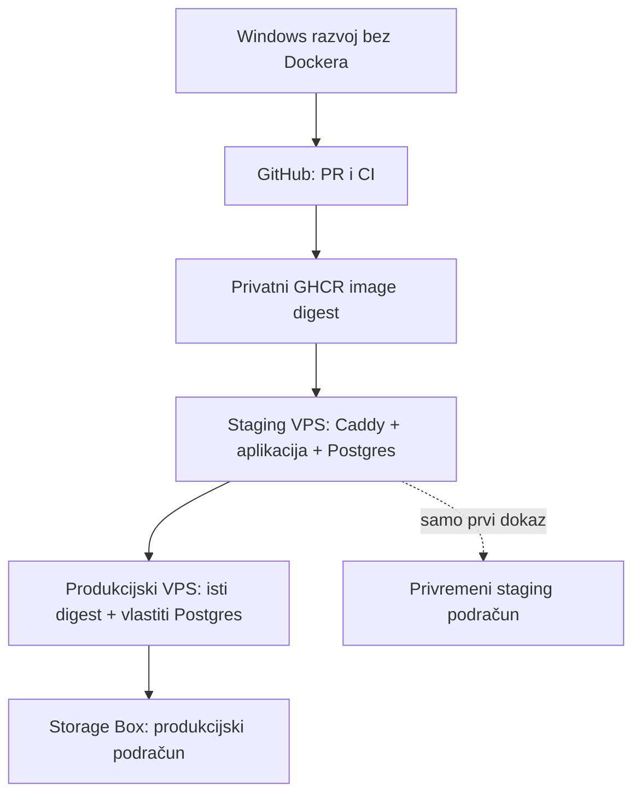

# Operacije for dummies: Kaladont od nule do produkcije

Ovaj vodič namijenjen je osobi koja nikada nije samostalno postavila aplikaciju na VPS. Ne pretpostavlja znanje Linuxa, Dockera, GitHub Actionsa, DNS-a ni PostgreSQL administracije. Svaki korak kaže gdje se izvodi, tko ga izvodi, što naredba radi, što trebaš vidjeti i kada moraš stati.

Autoritativne odluke su u [ADR-u 014](../03-arhitektura/odluke/014-operativni-model-mvp-a.md). Ovaj vodič objašnjava **kako** ih jednog dana provesti. Stručni sažeci i incidentni postupci ostaju u ostalim dokumentima ove mape.

> [!CAUTION]
> **DANAS STANI OVDJE.** Ovaj dokument opisuje ciljano stanje koje još nije implementirano. Trenutačno ne postoje svi potrebni Docker/Compose/Caddy artefakti, GitHub Actions workflowi, backup skripte i systemd jedinice. Aplikaciji također nedostaju produkcijski preduvjeti navedeni u sljedećem odjeljku. Ne kupuj staging ili produkcijski VPS i ne izvršavaj naredbe iza crvenog STOP-a dok cijela readiness lista nije zelena.

> [!IMPORTANT]
> U ovaj repozitorij nikada ne upisuj stvarnu IP adresu, lozinku, API ključ, privatni SSH ključ, Basic Auth hash, Storage Box pristup, email allowlistu ni Healthchecks URL. Primjeri koriste vrijednosti poput `<STAGING_IPV4>` koje moraš zamijeniti privatno tijekom stvarne postave.

## 1. Kako koristiti ovaj vodič

### Oznake

- **DANAS POSTOJI** — korak se oslanja na već implementiranu funkcionalnost.
- **CILJANO STANJE** — ovako mora raditi nakon dovršetka Faze 8.
- **STOP** — ne nastavljaj dok uvjet nije ispunjen. Ne pokušavaj „zaobići” provjeru.
- **Očekivani rezultat** — ono što moraš vidjeti prije sljedećeg koraka.
- **Ako nije tako** — sigurna prva reakcija; ne nasumično isprobavanje naredbi.

### Gdje se naredbe izvršavaju

Svaki blok ima oznaku mjesta:

| Oznaka                           | Gdje si                                                |
| -------------------------------- | ------------------------------------------------------ |
| **Windows / VS Code PowerShell** | terminal u VS Codeu na tvojem računalu                 |
| **GitHub web**                   | stranica repozitorija u pregledniku                    |
| **Hetzner Console**              | Hetznerovo web sučelje                                 |
| **XHosting podrška**             | poruka/ticket podršci koja upravlja DNS-om             |
| **Ubuntu / root**                 | SSH ili web-konzola VPS-a kao `root`                   |
| **Ubuntu / kaladont**             | osobni administrativni račun sa sudo ovlastima         |
| **Ubuntu / deploy**               | automatizirani račun bez sudoa, ali s Docker ovlastima |

Kada vidiš prompt s `PS>`, riječ je o PowerShellu. Kada vidiš `$`, riječ je o Ubuntu Bashu kao običnom korisniku. Znak `#` u primjeru znači root prompt ili komentar; nemoj ga slijepo prepisivati kao dio naredbe.

### Kako zamijeniti placeholder

Primjer:

```powershell
ssh kaladont@<STAGING_IPV4>
```

Ako je privatno spremljena staging adresa `192.0.2.10`, upisao bi `ssh kaladont@192.0.2.10`. Adresa `192.0.2.10` ovdje je dokumentacijski primjer, ne stvarni server.

Najčešći placeholderi:

| Placeholder                     | Što znači                                   | Gdje čuvaš stvarnu vrijednost         |
| ------------------------------- | ------------------------------------------- | ------------------------------------- |
| `<STAGING_IPV4>`                | zaštićena javna IPv4 staginga               | Bitwarden                             |
| `<PROD_IPV4>`                   | zaštićena javna IPv4 produkcije             | Bitwarden                             |
| `<GITHUB_KORISNIK>`             | vlasnik javnog GitHub repozitorija          | nije tajna                            |
| `<IMAGE_DIGEST>`                | puni `sha256:...` otisak aplikacijske slike | GitHub Deployment/evidencija          |
| `<AGE_RECIPIENT>`               | javni `age1...` ključ za šifriranje         | VPS konfiguracija i Bitwarden         |
| `<STORAGEBOX_HOST>`             | Hetzner Storage Box DNS ime                 | Bitwarden                             |
| `<STORAGEBOX_PROD_KORISNIK>`    | izolirani produkcijski podračun             | Bitwarden                             |
| `<STAGING_EMAIL_1>`             | puna dopuštena staging email adresa         | Bitwarden i staging `.env`, nikad git |
| `<STAGING_ADMIN_EMAIL>`         | postojeći staging račun koji dobiva admina  | Bitwarden; ne upisuje se u git        |
| `<PINANI_CADDY_IMAGE>`          | Caddy verzija i puni digest                 | verzionirani Compose                  |

## 2. Crveni STOP: production-readiness lista

Ovo je najvažniji odjeljak. **Na datum pisanja sve se kućice smatraju nedovršenima**, čak i ako je cilj opisan prezentom. Kućica se označava tek kada postoji konkretan artefakt u repozitoriju, automatski test i ručni dokaz gdje je potreban. VPS se kupuje tek kada za svaku stavku možeš zapisati commit/digest ili rezultat provjere.

### Aplikacija

- [ ] Fastify u produkciji poslužuje SvelteKit build iz **jednog Node procesa**.
- [ ] Produkcijski klijent koristi same-origin HTTP i Socket.IO, bez zapečenog `http://localhost:3000`.
- [ ] Fastify ima ispravan `trustProxy` samo za Caddy, a CORS nije reflektirano otvoren svim originima.
- [ ] Centralna konfiguracijska shema prekida startup ako nedostaje obvezna tajna ili se koristi razvojna zadana vrijednost.
- [ ] Centralna runtime provjera prekida staging/produkcijski startup s non-zero izlazom kada je `ONEMOGUCI_TIMER_POTEZA=true`; CI ima negativni test koji to dokazuje.
- [ ] `/zdravlje` provjerava bazu i rječnik, vraća 503 kada nisu spremni te prikazuje aktivne partije, uptime i digest bez tajni.
- [ ] Resend adapter stvarno šalje email; trenutačni log-only stub je uklonjen.
- [ ] Staging email allowlista točnih adresa radi fail-closed.
- [ ] Postoji jednokratni CLI za dodjelu prvog administratora; nije potreban ručni SQL.
- [ ] Postoje i pregledane su stranice `/privatnost` i `/uvjeti`.

### Repozitorij i CI/CD

- [ ] Postoji produkcijski multi-stage `Dockerfile` za `linux/amd64` i aplikacija u njemu radi kao ne-root korisnik.
- [ ] Postoje `docker-compose.staging.yml` i `docker-compose.prod.yml`.
- [ ] Postoje staging i produkcijska Caddy konfiguracija; staging štiti sve osim `/zdravlje`.
- [ ] PostgreSQL i Caddy koriste točnu verziju i digest, ne `latest`.
- [ ] Ista aplikacijska slika sadrži jednokratne alate za migracije, uvoz rječnika i admin CLI.
- [ ] Postoji mali sintetički rječnik za CI koji nije hrLex derivat.
- [ ] Postoje `ci.yml`, `objavi-staging.yml` i `promoviraj-produkciju.yml`.
- [ ] Sve third-party Actions reference pinane su na puni commit SHA.
- [ ] CI izgradi stvarnu sliku, podigne PostgreSQL, migrira, uveze fixture, provjeri health i odigra simulaciju.
- [ ] Privatni GHCR image moguće je povući kratkotrajnim `GITHUB_TOKEN`-om bez trajnog PAT-a na VPS-u.

### Backup i operacije

- [ ] Postoje verzionirane backup/restore skripte s dokumentiranim argumentima i zaštitom od produkcijskog cilja pri drillu.
- [ ] Postoje verzionirane systemd service/timer jedinice u UTC-u.
- [ ] Backup radi `pg_dump -Fc`, `age` enkripciju, prijenos, udaljenu SHA-256 provjeru i retenciju.
- [ ] Healthchecks dobiva start/success/fail bez logova i osobnih podataka.
- [ ] Postoji provjera diska koja pada iznad 80 %.
- [ ] Caddy/Compose konfiguracija, migracije i backup skripte testirani su u CI-ju koliko je praktično.

## 3. Što zapravo gradimo



Ukupno su dva aplikacijska VPS-a: staging i produkcija. `forum.kaladont.hr` je zasebna Discourse instalacija kojom se upravlja izvan ovog projekta. Njezin VPS, backup, monitoring i operativni postupci nisu dio ovog vodiča.

## 4. Pojmovnik bez žargona

| Pojam             | Jednostavno značenje                                                                |
| ----------------- | ----------------------------------------------------------------------------------- |
| VPS               | udaljeno Linux računalo koje radi 24/7                                              |
| unmanaged         | Hetzner daje računalo i mrežu; mi održavamo OS, Docker, bazu i aplikaciju           |
| SSH               | šifrirana udaljena terminalska veza                                                 |
| SSH ključ         | privatni dio ostaje kod vlasnika; javni dio daje serveru pravo da prepozna vlasnika |
| host fingerprint  | otisak servera kojim provjeravaš da se ne spajaš na lažni stroj                     |
| firewall          | popis mrežnih vrata koja smiju primati promet                                       |
| Docker image      | nepromjenjivi paket aplikacije i runtimea                                           |
| kontejner         | pokrenuta instanca imagea                                                           |
| volume            | trajni podaci koji preživljavaju zamjenu kontejnera                                 |
| Caddy             | jedini javni web ulaz; terminira HTTPS i prosljeđuje HTTP/WebSocket aplikaciji      |
| GHCR              | GitHub Container Registry, privatno spremište Docker imagea                         |
| digest            | jedinstveni `sha256:...` identitet sadržaja imagea                                  |
| DNS A zapis       | veza domene s IPv4 adresom                                                          |
| Primary IPv4      | javna Hetzner adresa koja se može sačuvati i dodijeliti zamjenskom VPS-u            |
| migracija         | verzionirana promjena sheme baze                                                    |
| backup            | kopija podataka namijenjena oporavku                                                |
| restore           | dokazano vraćanje backupa u praznu bazu                                             |
| RPO 24 h          | u najgorem prihvaćenom slučaju gubimo do 24 sata novih podataka                     |
| RTO 4 h           | potpuni servis mora se vratiti unutar četiri sata                                   |
| Pull Request (PR) | GitHub zahtjev za spajanje radne grane u `main`, uz diff i automatske provjere      |
| staging           | probno Linux okruženje s lažnim podacima                                            |
| produkcija        | javna igra sa stvarnim korisnicima                                                  |

## 5. Pripremi Bitwarden i recovery materijal

**Gdje:** Bitwarden web/desktop aplikacija i Windows / VS Code PowerShell  
**Tko:** ti, jedini operater

### 5.1. Struktura zapisa

Stvori kolekciju ili mapu `Kaladont / Operacije` i odvojene zapise:

- `GitHub i GHCR`;
- `Hetzner račun i recovery`;
- `XHosting DNS kontakt`;
- `SSH osobni admin ključ`;
- `SSH deploy staging`;
- `SSH deploy produkcija`;
- `Storage Box glavni račun`;
- `Storage Box produkcija`;
- `age recovery ključ`;
- `Staging pristup` (privremeno bez Caddy Basic Autha za multiplayer testiranje);
- `Resend produkcija`;
- `UptimeRobot`;
- `Healthchecks.io`.

Uključi 2FA na GitHubu, Hetzneru i Bitwardenu. Recovery kodovi ne smiju ostati samo u istom Bitwarden računu; pohrani ih i na šifrirani offline medij.

### 5.2. Instaliraj i generiraj `age` ključ

**Windows / VS Code PowerShell**

Najprije provjeri postoji li službeni winget paket:

```powershell
winget search --id FiloSottile.age
```

**Što radi:** pretražuje točan ID paketa; ništa ne instalira.  
**Očekivani rezultat:** redak za `FiloSottile.age`.  
**STOP ako:** nema točnog rezultata. Tada provjeri službenu age dokumentaciju i ne instaliraj paket sličnog imena.

```powershell
winget install --id FiloSottile.age --exact
age-keygen --version
```

**Što radi:** instalira alat i zatim ispisuje njegovu verziju.  
**Očekivani rezultat:** verzija `age-keygen`; nema poruke „command not found”.

Stvori privremeni recovery direktorij i ključ:

```powershell
New-Item -ItemType Directory -Force "$HOME\Kaladont-recovery"
age-keygen -o "$HOME\Kaladont-recovery\age-kljuc.txt"
```

**Očekivani rezultat:** terminal ispisuje samo javni ključ oblika `age1...`; datoteka sadrži privatni ključ.  
**Nikada:** ne šalji sadržaj datoteke u chat, git, GitHub Secret ili VPS.

U Bitwardenu napravi Secure Note `age recovery ključ`:

- privatni sadržaj iz datoteke spremi kao osjetljivu vrijednost;
- javni `age1...` recipient spremi u zasebno polje;
- zabilježi datum stvaranja.

Napravi Bitwarden **password-protected encrypted JSON** export na odvojeni offline medij. Lozinka izvoza nije ista kao master lozinka i čuva se odvojeno. Dokaz otvaranja radi se prema Bitwardenovu sigurnom recovery postupku, bez uvoza preko živog vaulta.

Tek kada su privatni ključ i šifrirani izvoz dvaput potvrđeni, ukloni privremenu plaintext datoteku:

```powershell
Remove-Item -LiteralPath "$HOME\Kaladont-recovery\age-kljuc.txt"
```

**Destruktivno:** naredba trajno briše lokalnu kopiju. Izvrši je samo nakon potvrde Bitwardena i offline recovery kopije.

## 6. Pripremi aplikacijski Storage Box

Ovaj Storage Box služi isključivo za šifrirane backup datoteke Kaladont aplikacije.

**Hetzner Console**

1. Stvori Storage Box za aplikacijske backupe.
2. Uključi SSH podršku i automatske snapshotove prema odabranoj retenciji.
3. Stvori zaseban produkcijski podračun `kaladont-produkcija`.
4. Za staging koristi privremeni podračun `kaladont-staging-dokaz` samo tijekom prvog dokaza backupa i restorea.

Glavni račun čuva se u Bitwardenu. Produkcija i staging koriste odvojene podračune, ključeve i konfiguracije.

## 7. GitHub priprema

### 7.1. Razvojni tok

Svaka promjena ide kroz radnu granu i Pull Request.

**Windows / VS Code PowerShell, u korijenu repozitorija**

```powershell
git switch -c naziv-promjene
git status --short
```

- `git switch -c` stvara novu granu i prebacuje te na nju.
- `git status --short` pokazuje promijenjene datoteke bez velikog ispisa.

Nakon rada:

```powershell
git add <TOCNE_DATOTEKE>
git commit -m "Dodati opis promjene"
git push -u origin naziv-promjene
```

Ne koristi `git add .` naslijepo. Commit poruka je hrvatski infinitiv + kratak opis. Na GitHubu otvori Pull Request prema `main`, pročitaj diff i čekaj sve obvezne zelene provjere prije mergea.

### 7.2. Branch protection

**GitHub web:** Repository → Settings → Rules/Branches → zaštita `main`.

Zahtijevaj:

- promjene preko Pull Requesta;
- prolazak obveznih CI provjera;
- zabranu force-pusha i brisanja `main`;
- razgovori moraju biti razriješeni prije mergea.

Ne zahtijevaj drugog reviewera: trenutačno postoji jedan operater. PR ipak ostaje obvezna kontrolna točka.

### 7.3. Environmenti

**GitHub web:** Repository → Settings → Environments.

Stvori `staging` i `produkcija`. Produkcija nema Required reviewers ni prevent-self-review, jer bi to stvaralo proces koji jedna osoba ne može pošteno ispuniti. Produkcijski workflow mora biti samo `workflow_dispatch`.

Tajne će se dodati nakon stvaranja VPS-a:

- `STAGING_HOST`, `STAGING_SSH_KLJUC`, `STAGING_SSH_KNOWN_HOSTS`;
- `PROD_HOST`, `PROD_SSH_KLJUC`, `PROD_SSH_KNOWN_HOSTS`.

Ne dodaje se ručni GHCR token. Workflow koristi ugrađeni, kratkotrajni `GITHUB_TOKEN`.

### 7.4. Privatni GHCR

Prvi uspješni workflow stvara package. Provjeri Package settings:

- visibility je Private;
- package je povezan s Kaladont repozitorijem;
- workflow repozitorij ima potreban package pristup;
- brisanje packagea nije dio deploy ovlasti.

Deploy uvijek koristi puni digest. `latest` služi eventualno ljudskom pregledu, nikad serveru.

## 8. Stvori staging Primary IPv4 i VPS

Ovaj odjeljak počinje **tek nakon zelene readiness liste**.

### 8.1. Nabavni gate

**Hetzner Console**

1. Odaberi lokaciju staging VPS-a prema cijeni, dostupnosti i vlastitom recovery planu.
2. Provjeri postoji li x86 CX23, 2 vCPU/4 GB, u odabranoj lokaciji.
3. Provjeri konačnu cijenu s PDV-om.

Ako CX23 nije dostupan, STOP. Ne kupuj CPX22 ili ARM samo da bi nastavio. Razlika može srušiti budžet ili zahtijevati novi image/recovery model.

### 8.2. Primary IPv4

Stvori zasebnu Primary IPv4 u odabranoj lokaciji:

- naziv `kaladont-staging-ip`;
- `Auto delete`: isključeno;
- Delete protection: uključeno.

Spremi IP u Bitwarden. Ova adresa treba preživjeti brisanje staging VPS-a.

### 8.3. Cloud Firewall

Stvori `kaladont-aplikacija-firewall` i dopusti dolazni IPv4 promet:

| Smjer   | Protokol | Port | Izvor    | Svrha                              |
| ------- | -------- | ---: | -------- | ---------------------------------- |
| Inbound | TCP      |   22 | Any IPv4 | osobni SSH i GitHub-hosted Actions |
| Inbound | TCP      |   80 | Any IPv4 | ACME/HTTP preusmjeravanje          |
| Inbound | TCP      |  443 | Any IPv4 | HTTPS i WebSocket                  |

Ne otvaraj 3000 ni 5432. Izlazni promet ostaje dopušten jer server treba apt, GHCR, Resend, Storage Box i monitoring. Cloud Firewall zaustavlja promet prije VPS-a, a UFW ostaje drugi sloj na samom OS-u; oba se održavaju usklađeno.

### 8.4. VPS

Stvori server:

- naziv `kaladont-staging`;
- lokacija: ista kao odabrana lokacija i Primary IP;
- image: Ubuntu 24.04 LTS;
- arhitektura: x86/amd64;
- bez Primary IPv6;
- plan: potvrđeni CX23 ili zasebno odobren ekvivalent;
- dodijeli `kaladont-staging-ip`;
- dodijeli Cloud Firewall;
- dodaj javni dio osobnog administratorskog SSH ključa;
- Hetzner daily backup: isključen za staging.

## 9. Provjeri identitet novog VPS-a

### 9.1. Fingerprint kroz Hetzner web-konzolu

**Hetzner Console → server → Console, Ubuntu / root**

```bash
ssh-keygen -lf /etc/ssh/ssh_host_ed25519_key.pub
```

Zapiši SHA256 fingerprint u Bitwarden. Ovo je neovisni kanal.

### 9.2. Usporedi s mrežnim ključem

**Windows / VS Code PowerShell**

Najprije potvrdi da Windows OpenSSH alati postoje:

```powershell
Get-Command ssh, ssh-keyscan, ssh-keygen -ErrorAction Stop
```

Očekuješ putanju za sva tri programa. Ako naredba padne, STOP i u Windows Settings → Apps → Optional features instaliraj **OpenSSH Client**, zatim ponovno otvori terminal.

```powershell
ssh-keyscan -t ed25519 <STAGING_IPV4> 2>$null |
  Set-Content -Encoding ascii "$HOME\.ssh\kaladont_staging_known_hosts"
ssh-keygen -lf "$HOME\.ssh\kaladont_staging_known_hosts"
```

Fingerprint mora biti znak-po-znak isti kao u Hetzner konzoli. Ako nije, STOP.

### 9.3. Prva prijava

```powershell
ssh root@<STAGING_IPV4>
```

Nakon prijave:

```bash
cat /etc/os-release
uname -m
timedatectl status
```

Očekuješ Ubuntu 24.04, `x86_64` i sinkroniziran sat. Ako je image ili arhitektura pogrešna, izbriši **samo VPS**, zadrži zaštićenu Primary IP i stvori ispravan server.

## 10. Ažuriraj OS i stvori korisnike

**Ubuntu / root**

```bash
apt update
apt upgrade -y
apt install -y unattended-upgrades ufw fail2ban ca-certificates curl
if [ -f /var/run/reboot-required ]; then
  echo 'Potreban je reboot prije nastavka.'
else
  echo 'Reboot trenutačno nije potreban.'
fi
```

- `apt update` osvježava popis paketa.
- `apt upgrade -y` instalira dostupne nadogradnje.
- završna provjera čita standardnu Ubuntu oznaku i sama ne radi reboot.

Ako kernel traži reboot tijekom prve postave, izvrši `reboot`, pričekaj da se server vrati i ponovno potvrdi fingerprint/SSH.

Postavi UTC:

```bash
timedatectl set-timezone UTC
timedatectl status
```

Stvori osobnog administratora. `adduser` je **interaktivan**: tražit će lozinku dvaput, zatim ime i ostala polja (njih možeš preskočiti tipkom Enter) te završnu potvrdu. Ne stavljaj ovaj blok u automatiziranu skriptu.

```bash
adduser kaladont
usermod -aG sudo kaladont
install -d -m 700 -o kaladont -g kaladont /home/kaladont/.ssh
cp /root/.ssh/authorized_keys /home/kaladont/.ssh/authorized_keys
chown kaladont:kaladont /home/kaladont/.ssh/authorized_keys
chmod 600 /home/kaladont/.ssh/authorized_keys
```

`adduser` će tražiti jaku sudo lozinku. Upiši je izravno u terminal i spremi u Bitwarden; ne šalji je kroz chat.

Stvori deploy korisnika:

```bash
adduser --disabled-password --gecos "" deploy
install -d -m 700 -o deploy -g deploy /home/deploy/.ssh
```

Deploy nema sudo i nema interaktivnu lozinku.

### 10.1. Provjeri admin pristup prije gašenja roota

Ostavi root terminal otvoren. Otvori novi VS Code PowerShell:

```powershell
ssh kaladont@<STAGING_IPV4>
```

Na VPS-u:

```bash
id
if sudo -v; then
  echo 'sudo radi za korisnika kaladont.'
else
  echo 'STOP: sudo provjera nije uspjela.'
fi
```

Očekuješ korisnika `kaladont`, grupe uključuju `sudo`, a `sudo -v` prihvaća njegovu lozinku.

## 11. Dodaj staging deploy ključ

**Windows / VS Code PowerShell**

```powershell
ssh-keygen -t ed25519 `
  -f "$HOME\.ssh\kaladont_deploy_staging" `
  -C "github-actions-staging"
scp "$HOME\.ssh\kaladont_deploy_staging.pub" `
  root@<STAGING_IPV4>:/tmp/kaladont_deploy_staging.pub
```

Za deploy ključ možeš ostaviti praznu passphrase samo zato što privatni ključ ide u zaštićenu GitHub Environment tajnu i služi jednoj automatizaciji. Osobni admin ključ mora ostati odvojen.

**Ubuntu / root**

```bash
install -m 600 -o deploy -g deploy \
  /tmp/kaladont_deploy_staging.pub \
  /home/deploy/.ssh/authorized_keys
rm -f /tmp/kaladont_deploy_staging.pub
```

**Windows / VS Code PowerShell**

```powershell
ssh -i "$HOME\.ssh\kaladont_deploy_staging" deploy@<STAGING_IPV4> id
```

Očekuješ `uid=... deploy`; ne root. Privatni ključ zatim spremi u GitHub Environment `staging` kao `STAGING_SSH_KLJUC`. Sadržaj datoteke `kaladont_staging_known_hosts` spremi kao `STAGING_SSH_KNOWN_HOSTS`, a IP kao `STAGING_HOST`.

Ne briši lokalnu recovery kopiju deploy ključa dok GitHub workflow nije dokazano uspješan; zatim je pohrani u Bitwarden ili sigurno ukloni prema politici pristupa.

## 12. Zaključaj SSH

**Ubuntu / kaladont**

Otvori novu konfiguracijsku datoteku:

```bash
sudoedit /etc/ssh/sshd_config.d/99-kaladont.conf
```

Upiši:

```text
PermitRootLogin no
PasswordAuthentication no
KbdInteractiveAuthentication no
PubkeyAuthentication yes
AllowUsers kaladont deploy
```

Prije primjene:

```bash
sudo sshd -t
```

**Očekivani rezultat:** nema ispisa i exit code je 0.  
**STOP ako:** postoji greška. Ne reloadiraj SSH; popravi navedenu liniju dok `sshd -t` ne prođe.

```bash
sudo systemctl reload ssh
```

Ne zatvaraj postojeću sesiju. Iz dva nova PowerShell terminala ponovno dokaži ulaz korisnika `kaladont` i `deploy`. Potvrdi i da `ssh root@<STAGING_IPV4>` te login lozinkom ne rade. Tek tada zatvori staru root sesiju.

## 13. Uključi fail2ban i UFW

**Ubuntu / kaladont**

```bash
sudoedit /etc/fail2ban/jail.d/sshd.local
```

Upiši:

```ini
[sshd]
enabled = true
maxretry = 5
findtime = 10m
bantime = 1h
```

Provjeri i pokreni:

```bash
sudo fail2ban-client -t
sudo systemctl enable --now fail2ban
sudo fail2ban-client status sshd
```

Prva naredba mora završiti bez konfiguracijske greške; zadnja mora prikazati aktivan `sshd` jail.

Zatim UFW:

```bash
sudo ufw default deny incoming
sudo ufw default allow outgoing
sudo ufw allow 22/tcp
sudo ufw allow 80/tcp
sudo ufw allow 443/tcp
sudo ufw enable
sudo ufw status verbose
```

Prije `ufw enable` potvrdi da postoji pravilo 22 i da je aktivna SSH sesija. Očekuješ samo 22/80/443. Hetzner Cloud Firewall već mora imati ista tri pravila.

## 14. Instaliraj Docker iz službenog repozitorija

**Ubuntu / kaladont**

Najprije ukloni eventualne konfliktne pakete. Na novom serveru poruka da neki nisu instalirani je normalna:

```bash
sudo apt remove -y \
  docker.io docker-compose docker-compose-v2 docker-doc \
  podman-docker containerd runc
sudo apt update
sudo apt install -y ca-certificates curl
sudo install -m 0755 -d /etc/apt/keyrings
sudo curl -fsSL https://download.docker.com/linux/ubuntu/gpg \
  -o /etc/apt/keyrings/docker.asc
sudo chmod a+r /etc/apt/keyrings/docker.asc
```

Dodaj službeni apt izvor:

```bash
sudo tee /etc/apt/sources.list.d/docker.sources >/dev/null <<EOF
Types: deb
URIs: https://download.docker.com/linux/ubuntu
Suites: $(. /etc/os-release && echo "${UBUNTU_CODENAME:-$VERSION_CODENAME}")
Components: stable
Architectures: $(dpkg --print-architecture)
Signed-By: /etc/apt/keyrings/docker.asc
EOF
sudo apt update
```

Provjeri da kandidat dolazi s `download.docker.com`, ne iz neočekivanog izvora:

```bash
apt-cache policy docker-ce
```

Instaliraj:

```bash
sudo apt install -y \
  docker-ce docker-ce-cli containerd.io \
  docker-buildx-plugin docker-compose-plugin
sudo systemctl enable --now docker containerd
sudo systemctl status docker --no-pager
```

Dodaj samo deploy korisnika u Docker grupu:

```bash
sudo usermod -aG docker deploy
sudo -iu deploy docker run --rm hello-world
sudo -iu deploy docker compose version
```

Očekuješ poruku `Hello from Docker!` i verziju Compose plugina. Ako dobiješ permission denied, potpuno prekini i ponovno pokreni deploy login sesiju; ne mijenjaj dopuštenja `/var/run/docker.sock` na 666.

### 14.1. Rotacija Docker logova

```bash
if sudo test -e /etc/docker/daemon.json; then
  echo 'STOP: daemon.json već postoji; napravi backup i ručno spoji postavke.'
else
  echo 'Datoteka ne postoji; sigurno je stvoriti novu.'
fi
```

Ako dobiješ STOP poruku, ne nastavljaj na primjer za novu datoteku. Prvo napravi kopiju `sudo cp /etc/docker/daemon.json /etc/docker/daemon.json.prije-kaladonta`, pročitaj postojeći JSON i spoji samo `log-driver` bez brisanja drugih ključeva.

Cilj je Docker `local` logging driver:

```bash
sudoedit /etc/docker/daemon.json
```

Sadržaj za novu praznu datoteku:

```json
{
  "log-driver": "local"
}
```

Provjeri i restartaj samo tijekom postave, prije aplikacije:

```bash
# Docker CE 26.0+ iz službenog repozitorija podržava ovu provjeru.
sudo dockerd --validate --config-file=/etc/docker/daemon.json
```

Očekuješ potvrdu valjane konfiguracije. Ako naredba vrati grešku, ponovno otvori `sudoedit /etc/docker/daemon.json` i popravi JSON. **Ne izvršavaj restart dok validacija nije uspješna.**

Tek nakon uspješne validacije:

```bash
sudo systemctl restart docker
sudo systemctl status docker --no-pager
sudo docker info --format '{{.LoggingDriver}}'
```

Očekuješ aktivan Docker servis i `local`. Ako servis nije aktivan, pregledaj `sudo journalctl -u docker --since "10 minutes ago" --no-pager` i vrati prethodni `daemon.json`; ne nastavljaj na aplikaciju.

## 15. Pripremi deploy direktorij

**Ubuntu / kaladont**

```bash
sudo install -d -m 750 -o deploy -g deploy /opt/kaladont
sudo -u deploy install -m 600 /dev/null /opt/kaladont/.env
sudo ls -ld /opt/kaladont
sudo ls -l /opt/kaladont/.env
```

Očekuješ vlasnika `deploy`, direktorij 750 i `.env` 600. Na VPS-u nema git repozitorija. Workflow prenosi samo verzionirane konfiguracije i povlači gotov digest.

> [!CAUTION]
> Točan `.env` još se ne može napisati jer centralna produkcijska konfiguracijska shema nije implementirana. Kada bude gotova, ovaj vodič mora navesti svaku obveznu varijablu, tko je generira, dopušteni format i fail-fast provjeru. Ne sastavljaj `.env` prema današnjem `.env.primjer` napamet.

Ciljana konfiguracija mora obuhvatiti barem:

- internu `BAZA_URL` prema Compose servisu `baza`;
- jedinstvenu nasumičnu `SESIJA_TAJNA`;
- oznaku staging okruženja;
- aplikacijski digest/verziju;
- Resend staging ključ/način i popis punih allowlistanih adresa;
- staging pristupni model i kasniji gateway (trenutno nema Basic Autha zbog Socket.IO promptova);
- Storage Box podračun/ključ i javni `age` recipient;
- zasebne Healthchecks ping URL-ove;
- `ONEMOGUCI_TIMER_POTEZA` izostavljen ili strogo `false`.

Tajnu generiraj na VPS-u bez prikaza u dokumentu:

```bash
openssl rand -base64 48
```

Rezultat odmah spremi u Bitwarden i deploy-owned `.env` s pravima 600; ne lijepi ga u chat. Svako okruženje ima drugu vrijednost.

## 16. Staging pristup

Privremeni staging nema Caddy Basic Auth jer browser HTTP Basic izaziva ponavljajuće promptove na API i Socket.IO polling/upgrade zahtjevima. Staging je zato javno dostupan uz `X-Robots-Tag: noindex, nofollow`, što nije sigurnosna kontrola. Ne dijeli staging URL izvan testiranja. Prije šireg dijeljenja uvedi VPN, IP allowlist ili drugi session-based gateway.

`/zdravlje` i ostatak aplikacije prolaze kroz isti Caddy reverse proxy bez dodatnog browser prompta, pa Socket.IO može stabilno koristiti polling i WebSocket upgrade.

## 17. Zatraži staging DNS od XHostinga

**XHosting podrška**

Predložak:

```text
Predmet: A zapis za staging.kaladont.hr

Poštovani,

molim postavite sljedeći DNS zapis za domenu kaladont.hr:

Vrsta: A
Naziv/host: staging
Vrijednost: <STAGING_IPV4>

Molim da se ne dodaje AAAA zapis i da zapis ne ide kroz proxy/CDN.

Molim potvrdu nakon primjene.

Hvala.
```

Nakon njihove potvrde:

**Windows / VS Code PowerShell**

```powershell
Resolve-DnsName staging.kaladont.hr -Type A
nslookup staging.kaladont.hr
```

Oba rezultata moraju pokazati `<STAGING_IPV4>`. Ako pokazuju drugu adresu, pošalji XHostingu rezultat i ne pokreći Caddy certifikat.

## 18. Prvi staging deploy

Ovaj odjeljak postaje izvršiv tek kada workflowi i artefakti postoje.

### 18.1. Što workflow mora napraviti

1. izgraditi i smoke-testirati image;
2. objaviti privatni GHCR digest;
3. spojiti se kao `deploy` uz pinani fingerprint;
4. prenijeti/validirati Compose i Caddy konfiguraciju;
5. kratkotrajno se prijaviti u GHCR;
6. povući digest;
7. iz tog digesta primijeniti migracije;
8. provjeriti broj riječi i samo ako je nula uvesti hrLex;
9. pokrenuti aplikaciju;
10. ukloniti GHCR vjerodajnice;
11. čekati `/zdravlje` 200 s očekivanim digestom.

Ciljani jednokratni oblici naredbi bit će nalik sljedećima, ali **ne izvršavaj ih dok stvarni Compose servisi i skripte ne budu implementirani**:

```bash
# CILJANO STANJE - NE POKUŠAVAJ IZVRŠITI DANAS
# Nazivi se moraju uskladiti sa stvarnom implementacijom.
docker compose -f docker-compose.staging.yml config --quiet
docker compose -f docker-compose.staging.yml run --rm alati migracije
docker compose -f docker-compose.staging.yml run --rm alati uvezi-rjecnik-ako-je-prazan
docker compose -f docker-compose.staging.yml up -d
docker compose -f docker-compose.staging.yml ps
```

### 18.2. Pokreni kroz PR

Spoji potpuno zeleni PR u `main`. U GitHub Actionsu očekuješ redom:

- CI zelen;
- Docker smoke test zelen;
- privatni GHCR push s digestom;
- staging deployment zelen;
- `/zdravlje` prikazuje isti digest.

Ako bilo koji korak padne, ne pokreći sljedeći ručno preko SSH-a. Otvori log točno tog koraka i popravi implementaciju novim PR-om.

### 18.3. Provjeri staging izvana

**Windows / VS Code PowerShell**

```powershell
Invoke-RestMethod https://staging.kaladont.hr/zdravlje
```

Očekuješ `ok: true`, bazu `dostupna`, broj riječi veći od nule i digest iz workflowa.

Provjeri da naslovnica bez Basic Autha vraća 401:

```powershell
try {
  (Invoke-WebRequest https://staging.kaladont.hr/).StatusCode
} catch {
  [int]$_.Exception.Response.StatusCode
}
```

Očekuješ `401`. U pregledniku zatim unesi zajedničke staging vjerodajnice iz Bitwardena i provjeri da stranica radi te ima `X-Robots-Tag: noindex, nofollow`.

Na VPS-u provjeri javne portove:

```bash
sudo ss -lntp
```

Očekuješ javne 22, 80 i 443. Ne smiješ vidjeti javno vezane 3000 ili 5432.

### 18.4. Odigraj cijelu staging partiju

Trebaju četiri **izolirana browser konteksta**, svaki sa svojim localStorageom. Dva taba istog običnog ili privatnog profila dijele spremište i nisu dva igrača. Koristi zasebne browser profile ili različite preglednike; nakon ulaska u red vizualno potvrdi četiri različita nadimka/identiteta. Primjer:

- obični Edge profil;
- Edge InPrivate;
- Chrome Guest profil;
- Firefox Private ili zaseban browser profil.

Ako se jedan novi prozor odspajanjem drugoga ponaša kao isti igrač, izolacija nije uspjela. Zatvori taj kontekst, napravi novi zasebni profil i ponovi prije početka partije.

Svaki ulazi u red. Provjeri od početka do kraja:

- četiri različita identiteta;
- countdown i početak partije;
- prihvaćenu i odbijenu riječ;
- timer i „Ne znam”;
- eliminaciju i promatranje;
- emoji/brzu poruku;
- povijest poteza;
- kraj, plasman i bodove;
- novu partiju nakon završetka.

Ako išta ne radi, staging kandidat nije spreman za produkciju čak i ako je CI zelen.

### 18.5. Email i prvi admin

Staging Resend konfiguracija mora poslati samo adresama iz `STAGING_EMAIL_ALLOWLIST`. Pokušaj registracije s jednom dopuštenom i jednom nedopuštenom adresom. Dopuštena prima poruku; nedopuštena ne prima ništa, a server bilježi siguran razlog bez sadržaja/tajni.

Prvi admin nastaje budućim jednokratnim CLI alatom iz istog digesta. Ciljani Compose servis `alati` nije drugi stalni proces: koristi **isti aplikacijski image/digest**, pokreće zadanu administrativnu naredbu i briše se nakon završetka (`run --rm`). Njegov stvarni naziv i argumenti moraju biti implementirani i testirani prije uporabe:

```bash
# CILJANO STANJE - NE IZVODITI DOK ADMIN CLI NE POSTOJI
docker compose -f docker-compose.staging.yml run --rm alati \
  dodijeli-admina --email <STAGING_ADMIN_EMAIL>
```

Alat mora tražiti eksplicitno okruženje/ potvrdu, pronaći već registriran i potvrđen račun te evidentirati promjenu. Ručni SQL nije dopušten postupak.

## 19. Dokaži staging backup i restore

Stvori privremeni Storage Box podračun `kaladont-staging-dokaz` sa zasebnim ključem. Budući backup service mora:

- napraviti `pg_dump -Fc` sintetičke staging baze;
- šifrirati javnim `age` recipientom;
- prenijeti i provjeriti SHA-256;
- poslati Healthchecks success.

Ciljani poziv:

```bash
# CILJANO STANJE - SERVICE JOŠ NE POSTOJI
sudo systemctl start kaladont-backup.service
sudo systemctl status kaladont-backup.service --no-pager
sudo journalctl -u kaladont-backup.service --since "15 minutes ago" --no-pager
```

Zatim vrati kopiju u očito imenovanu praznu izoliranu bazu. Restore alat mora odbiti produkcijski/staging glavni DB URL i zahtijevati eksplicitni privremeni cilj.

Checkpoint je zelen samo kada:

- udaljena `.age` datoteka i hash postoje;
- privatni `age` ključ uspješno dešifrira kopiju;
- `pg_restore --list` čita dump;
- ključne tablice, rječnik i zadnja testna partija postoje u obnovljenoj bazi;
- glavna staging baza nije mijenjana;
- privremeni DB kontejner/volume i dešifrirani dump su uklonjeni;
- datum i trajanje zapisani su u održavanje.

**Tek sada smiješ kupiti produkcijski VPS.**

## 20. Postavi produkcijski VPS

Ponovi staging odjeljke 9–16, ali s ovim razlikama:

| Stavka               | Produkcija                                             |
| -------------------- | ------------------------------------------------------ |
| Primary IP naziv     | `kaladont-produkcija-ip`                               |
| VPS naziv            | `kaladont-produkcija`                                  |
| Deploy ključ         | novi `kaladont_deploy_produkcija`, nikad staging ključ |
| GitHub Environment   | `produkcija`                                           |
| Hetzner daily backup | uključen                                               |
| Basic Auth           | nema ga                                                |
| Podaci               | vlastita prazna produkcijska baza; ništa sa staginga   |
| Storage Box          | trajni zasebni produkcijski podračun                   |
| Email                | pravi Resend, bez staging allowliste                   |
| Monitoring           | UptimeRobot + Healthchecks.io                          |

Produkcijski VPS mora biti Ubuntu 24.04 x86 u odabranoj lokaciji i koristiti zaštićenu produkcijsku Primary IPv4. Ne klonira git i ne dobiva trajni GHCR token.

## 21. Zatraži produkcijski DNS i Resend zapise

### 21.1. A zapisi

```text
Predmet: A zapisi za kaladont.hr

Poštovani,

molim postavite sljedeće DNS zapise:

A    @      <PROD_IPV4>
A    www    <PROD_IPV4>

Molim da se ne dodaju AAAA zapisi i da zapisi ne idu kroz proxy/CDN.
Postojeći zapis `forum.kaladont.hr` ne mijenjati. Staging DNS zapis postavi zasebno.

Molim potvrdu nakon primjene.

Hvala.
```

Provjeri:

```powershell
Resolve-DnsName kaladont.hr -Type A
Resolve-DnsName www.kaladont.hr -Type A
```

Oba moraju pokazati `<PROD_IPV4>`.

### 21.2. Resend

U Resendu dodaj domenu `kaladont.hr` i kao produkcijski pošiljatelj koristi `noreply@kaladont.hr`. Ljudski kontakt i Reply-To je `kontakt@kaladont.hr`.

Resend će prikazati DNS zapise. Nemoj ih prepisivati iz ovog dokumenta jer su vrijednosti jedinstvene. XHostingu pošalji:

```text
Predmet: DNS zapisi za Resend na kaladont.hr

Poštovani,

molim postavite sljedeće DNS zapise točno kako su navedeni ispod.
Ne mijenjati razmake, navodnike, prioritet ni vrijednosti i ne uklanjati postojeće zapise domene.

<OVDJE ZALIJEPITI TOCNE RESEND ZAPISE IZ NJIHOVOG SUCELJA>

Molim potvrdu nakon primjene.

Hvala.
```

Nastavi tek kada Resend označi domenu verificiranom i SPF/DKIM prolaze. API ključ spremi u Bitwarden i produkcijski VPS `.env`; ne u GitHub ni git.

Prije javnog lansiranja pošalji stvarnu potvrdu registracije i reset lozinke na adresu koju kontroliraš. Provjeri pošiljatelja, poveznicu, istek tokena i Reply-To.

## 22. Produkcijski backup i monitoring prije aplikacije

Stvori trajni Storage Box podračun `kaladont-produkcija`, zaseban SSH ključ i pinani host fingerprint. Postavi verzionirane backup/restore skripte i systemd jedinice.

### Healthchecks.io

Stvori zasebne checkove:

- `kaladont-produkcija-backup`, očekivan dnevno nakon 04:00 UTC;
- `kaladont-produkcija-disk`, prema implementiranom rasporedu;

Ping URL svakog checka je tajna. Spremi ga u Bitwarden i root-only konfiguraciju odgovarajućeg servera. Ne šalji stdout/stderr Healthchecksu.

Healthchecks ne dolazi po status na VPS. Buduća systemd skripta sama šalje tri vrste kratkog HTTP signala:

```bash
# CILJANI OBLIK UNUTAR BUDUĆE SKRIPTE; URL JE TAJNA IZ KONFIGURACIJE
curl -fsS -m 10 --retry 5 -o /dev/null "${HEALTHCHECK_URL}/start"
curl -fsS -m 10 --retry 5 -o /dev/null "${HEALTHCHECK_URL}"
curl -fsS -m 10 --retry 5 -o /dev/null "${HEALTHCHECK_URL}/fail"
```

`/start` znači da je posao počeo, osnovni URL da je uspješno završio, a `/fail` da je skripta uhvatila neuspjeh. Success se šalje samo nakon udaljene SHA-256 provjere. Skripta mora poslati fail kroz kontrolirani error handler; ne izvršavaju se sva tri retka jedan za drugim.

### UptimeRobot

Stvori HTTPS monitor za `https://kaladont.hr/zdravlje`, interval 5 minuta, alert contact email. Nakon prvog deploya kontrolirano testiraj i DOWN i RECOVERY poruku.

### Systemd provjera

Kada jedinice postoje:

```bash
sudo systemctl daemon-reload
sudo systemctl enable --now kaladont-backup.timer
sudo systemctl enable --now kaladont-disk-provjera.timer
sudo systemctl list-timers --all | grep kaladont
```

Očekuješ oba timera i sljedeće UTC vrijeme izvršavanja. Ručno pokreni backup i dokaži udaljeni hash prije prve migracije.

## 23. Prva produkcijska promocija

Prije pokretanja mora postojati:

- puni staging digest;
- zelena staging browser partija;
- zeleni staging backup/restore dokaz;
- zdrava produkcijska infrastruktura i prazna baza;
- verificiran Resend;
- stranice Privatnost i Uvjeti;
- produkcijski Storage Box i monitori.

**GitHub web:** Actions → `promoviraj-produkciju` → Run workflow.

Unesi puni staging `sha256:...` digest. Workflow mora:

1. zapisati prethodni digest ili jasno označiti da je ovo prvi deploy;
2. napraviti i potvrditi produkcijski backup kada baza već postoji;
3. povući isti privatni digest;
4. migrirati i, samo ako je rječnik prazan, uvesti hrLex;
5. pokrenuti aplikaciju;
6. ukloniti GHCR vjerodajnice;
7. potvrditi health i digest.

Nema dodatnog approval klika i nema automatskog rollbacka.

### 23.1. Ručna produkcijska provjera

```powershell
Invoke-RestMethod https://kaladont.hr/zdravlje
# Ovaj blok namjerno koristi HTTP kako bi provjerio preusmjeravanje na HTTPS.
try {
  (Invoke-WebRequest http://kaladont.hr -UseBasicParsing -MaximumRedirection 0 -ErrorAction Stop).StatusCode
} catch {
  [int]$_.Exception.Response.StatusCode
}
```

Health mora biti 200 s očekivanim digestom. Druga provjera mora vratiti HTTP redirect status (Caddy tipično 308), a ne 200 ili grešku povezivanja. Otvori i `https://www.kaladont.hr`; mora preusmjeriti na kanonsku domenu.

Provjeri stranice:

- `/`;
- `/pravila`;
- `/o-igri` s hrLex atribucijom;
- `/privatnost`;
- `/uvjeti`;
- registraciju, potvrdu emaila, prijavu i reset lozinke;
- admin prijavu i osnovnu rutu.

Zatim odigraj cijelu partiju u četiri izolirana browser konteksta. Dogovoreno je da probna partija ostaje u običnoj produkcijskoj statistici. U evidenciju upiši datum, digest i ID/identitete testne partije kako bi se mogla prepoznati u malom uzorku metrika.

## 24. Svakodnevni release

1. Na Windowsu stvori radnu granu.
2. Napravi usku promjenu i lokalne provjere.
3. Pushni granu i otvori PR.
4. Pročitaj diff i čekaj zeleni CI.
5. Mergeaj u `main`.
6. Pričekaj automatski staging deploy i zapiši digest.
7. Na stagingu odigraj cijelu partiju i ciljano testiraj promjenu.
8. Odaberi produkcijski termin slabog prometa.
9. Ručno pokreni produkcijski workflow s istim digestom.
10. Prati pre-migration backup, migracije i health.
11. Provjeri produkciju i odigraj cijelu partiju.
12. Upiši izdanje i testnu partiju u evidenciju.

Ne postoji korak „SSH na server i brzo promijeni datoteku”. Takva promjena nema testirani digest ni pouzdan rollback.

## 25. Planirano održavanje

Za redovni deploy od nekoliko sekundi ne radi se posebna najava. Za očekivani prekid dulji od 5 minuta:

1. najmanje 24 sata ranije objavi temu u forum kategoriji Obavijesti;
2. kroz prethodni redovni deploy uključi banner s datumom u Europe/Zagreb vremenu;
3. navedi početak, očekivano trajanje i pogođenu funkcionalnost;
4. nakon završetka ukloni banner sljedećim kontroliranim deployem i ažuriraj forum.

Hitna sigurnosna intervencija smije skratiti rok, ali razlog se bilježi u incidentu.

## 26. Ručni rollback unutar 15 minuta

Ako nova verzija ne prođe health ili ručnu provjeru:

1. spremi problematični digest, workflow sažetak i relevantne logove;
2. uzmi prethodni puni digest koji je workflow zapisao prije zamjene;
3. Actions → `promoviraj-produkciju` → Run workflow;
4. unesi prethodni digest;
5. čekaj health i potvrdi da endpoint prikazuje vraćeni digest;
6. provjeri ključne stranice i cijelu partiju;
7. zapiši vrijeme detekcije, početka rollbacka i oporavka.

Ne rebuildaj staru verziju. Ne koristi `latest`. Ne vraćaj bazu samo zato što je aplikacijski deploy loš; migracije moraju omogućiti starom digestu rad nad novom shemom.

## 27. Mjesečni restore drill

Restore se radi na produkcijskom VPS-u u praznu, izoliranu bazu bez javnog porta. Ne radi se na stagingu jer produkcijski podaci ne smiju tamo završiti.

Sigurni redoslijed:

1. zabilježi odabranu `.age` kopiju i njezin udaljeni SHA-256;
2. provjeri slobodan disk/RAM;
3. preuzmi kopiju i provjeri hash;
4. privatni `age` ključ privremeno postavi u root-only datoteku na `/dev/shm` bez shell historyja;
5. dešifriraj i pokreni `pg_restore --list`;
6. podigni očito imenovan privremeni DB/volume;
7. vrati dump i provjeri tablice, rječnik i zadnju partiju;
8. zapiši trajanje i rezultat;
9. ukloni samo privremeni DB/volume, plaintext dump i privremeni privatni ključ;
10. ponovno provjeri živu aplikaciju.

Buduća restore skripta mora odbiti živu `BAZA_URL` i zahtijevati eksplicitnu potvrdu cilja. Dok ta zaštita nije implementirana, STOP.

## 28. Potpuni recovery VPS-a

Izvodi se prije lansiranja i svakih šest mjeseci. Cilj je završiti unutar četiri sata.

1. Pokreni sat i zapis.
2. Stvori privremeni Ubuntu 24.04 x86 VPS u istoj lokaciji.
3. Primijeni odjeljke za korisnike, SSH, firewalle i Docker.
4. U kontroliranom drill scenariju dodijeli testnu/zaštićenu Primary IPv4 samo kada je izvorni stroj ugašen i plan to dopušta.
5. Postavi produkcijsku konfiguraciju iz Bitwardena, ne iz starog diska naslijepo.
6. Vrati autoritativni Storage Box dump u novi volume.
7. Povuci zadnji zdravi aplikacijski digest.
8. Pokreni Caddy, bazu i aplikaciju.
9. Provjeri TLS, health, portove, email, admin i cijelu partiju.
10. Ponovno uključi backup i monitoring te napravi novi potvrđeni backup.
11. Zapiši trajanje i svaki korak koji nije bio u dokumentu.

U pravom incidentu produkcijska zaštićena Primary IPv4 prebacuje se na zamjenski server, pa XHosting DNS ostaje nepromijenjen. Ako IP nije sačuvan ili je potrebna druga lokacija, odmah otvori hitni XHosting ticket; tada RTO više nije potpuno pod našom kontrolom.

## 29. Što provjeravaš redovito

### Dnevno, oko 2 minute

- UptimeRobot/Healthchecks/GitHub email alarmi;
- zadnji backup heartbeat;
- zadnji `main` workflow.

### Tjedno, oko 10–15 minuta

- aplikacijski/Caddy warn i error uzorci;
- disk/RAM trend svih VPS-ova;
- Docker disk usage;
- Dependabot PR-ovi.

### Mjesečno, 60–90 minuta

- izolirani produkcijski DB restore drill;
- OS i pinane image nadogradnje kroz PR → staging → produkcija;
- ciljano čišćenje starih slika uz očuvanje aktivnog i prethodnog digesta.

### Kvartalno

- staging rollback drill;
- pregled i rotacija deploy ključeva;
- pregled dokumentacije i pristupa.

### Svakih šest mjeseci

- potpuni VPS recovery drill i mjerenje RTO-a.

### Godišnje

- Bitwarden encrypted export i recovery test;
- 2FA kodovi i `age` ključ;
- DPA, cijene, domena i rizik jednog pružatelja;
- velika revizija operativnih dokumenata.

## 30. Umami dolazi kasnije

Javni rani pristup smije krenuti bez Umamija. Od prvog dana mjerimo partije, čekanje, registracije, povratak i prijave iz baze.

Tek nakon stabilizacije:

1. provjeri stvarni RAM/CPU/disk produkcije;
2. kroz PR dodaj pinani Umami servis i baznu konfiguraciju;
3. uključi ga u backup, health granice i privatnost;
4. testiraj konfiguraciju na stagingu bez produkcijskih podataka;
5. XHostingu zatraži A zapis `analitika.kaladont.hr`;
6. ručno promoviraj isti digest/config release;
7. provjeri da pad Umamija ne ruši igru.

Umami ne dobiva zaseban VPS dok mjerenje ne pokaže stvarnu potrebu.

## 31. Naredbe koje ne izvršavaš naslijepo

Sljedeće naredbe mogu trajno uništiti podatke ili pristup. Ovdje su navedene kao upozorenje, ne kao uputa:

```text
docker compose down -v
docker volume rm ...
docker system prune --volumes
rm -rf /var/lib/docker
DROP DATABASE ...
git reset --hard
git clean -fdx
ufw reset
```

Prije bilo koje destruktivne radnje moraš znati:

1. na kojem si stroju i kao koji korisnik;
2. koji točno resurs naredba dira;
3. postoji li svjež, udaljen i testiran backup;
4. kako izgleda povrat;
5. je li aktivna aplikacija zaustavljena kada podaci to zahtijevaju.

Ako naredba sadrži `-v`, `--volumes`, `rm`, `prune`, `drop`, `delete`, `reset` ili `force`, stani i pročitaj službenu dokumentaciju i odgovarajući runbook.

## 32. Završni checkpointovi

### Staging je spreman kada

- [ ] Production-readiness lista je potpuno zelena.
- [ ] Ubuntu 24.04 x86, zaštićena Primary IPv4 i oba firewalla su potvrđeni.
- [ ] Root/password SSH ne rade; `kaladont` i `deploy` ključevi rade.
- [ ] Javno su otvoreni samo 22/80/443.
- [ ] CI gradi, testira i objavljuje privatni digest.
- [ ] Merge u `main` automatski deploya staging.
- [ ] `/zdravlje` je javno i zdravo; ostatak staginga traži Basic Auth i ima noindex.
- [ ] Cijela partija prolazi u četiri izolirana browser konteksta.
- [ ] Email stiže allowlistanoj i ne stiže nedopuštenoj adresi.
- [ ] Admin CLI radi bez ručnog SQL-a.
- [ ] Staging dump je šifriran, prenesen i vraćen u praznu izoliranu bazu.

### Produkcija je spremna kada

- [ ] Staging checkpoint je potpuno zelen.
- [ ] Produkcija ima zasebnu zaštićenu Primary IPv4, VPS, ključeve, `.env` i Storage Box podračun.
- [ ] XHosting A i Resend SPF/DKIM zapisi su provjereni.
- [ ] Hetzner daily backup, systemd timeri, Healthchecks i UptimeRobot rade.
- [ ] Ručna promocija prihvaća samo staging digest.
- [ ] Pre-migration backup je dokazan.
- [ ] Health, pravne stranice, email, admin i cijela produkcijska partija prolaze.
- [ ] Ručni rollback drill vraća prethodni digest unutar 15 minuta.
- [ ] Potpuni recovery drill vraća servis unutar četiri sata.

## 33. Kamo ideš kada nešto ne radi

| Problem                                  | Dokument                                                   |
| ---------------------------------------- | ---------------------------------------------------------- |
| workflow, GHCR ili digest                | [CI/CD](ci-cd.md)                                          |
| redovna objava ili rollback              | [Runbook objave i rollbacka](runbook-objava-i-rollback.md) |
| dump, restore ili cijeli VPS             | [Runbook backupa i vraćanja](runbook-backup-i-vracanje.md) |
| health, log ili alarm                    | [Nadzor i dnevnici](nadzor-i-dnevnici.md)                  |
| sigurnost, tajna ili kompromitiran ključ | [Sigurnost i privatnost](sigurnost-i-privatnost.md)        |
| aktivni kvar                             | [Incidentni postupak](incidentni-postupak.md)              |
| redovita rutina                          | [Održavanje](odrzavanje.md)                                |
| veličina i cijena servera                | [Dimenzioniranje](dimenzioniranje-posluzitelja.md)         |

Najvažnije pravilo ostaje jednostavno: **stani na prvoj neočekivanoj razlici, sačuvaj dokaz i ne popravljaj tri stvari odjednom.**
