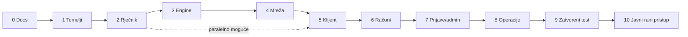

# Faze razvoja

Svaka faza ima **kriterij završetka** — mjerljivo stanje, ne osjećaj. Faza se ne otvara dok prethodna ne zadovolji kriterij (iznimka: dokumentacija se dopunjava stalno).

> **Stanje 2026-09-09:** lokalna MVP jezgra, HTTP sučelje, Docker/Compose/Caddy artefakti, CI smoke test, prošireni health check i GHCR objava su implementirani. Staging VPS je ručno postavljen s HTTPS-om i stvarnim hrLex rječnikom. Automatski staging deploy, produkcijski deploy, trustProxy/CORS učvršćivanje, prvi-admin CLI i backup/restore automatika još nisu implementirani.

## Faza 0 — Dokumentacija ✅

Kompletna dokumentacija u `docs/` prije prve linije koda.
**Kriterij:** svaka donesena odluka ima svoj autoritativni dokument; kazalo potpuno.

## Faza 1 — Temelji monorepa

pnpm workspaces, TypeScript strict konfiguracija, ESLint + Prettier, Vitest te početne aplikacije `web` i `posluzitelj`. Lokalni razvoj koristi native PostgreSQL jer Windows računalo nema dostupnu virtualizaciju; Docker i CI/CD pripadaju Fazi 8.
**Kriterij:** `pnpm dev` podiže obje aplikacije uz lokalni PostgreSQL; početni lint, build i testovi prolaze.

## Faza 2 — Rječnik

Paket `zajednicko`: grafemi s iznimkama, testovi. Skripta uvoza hrLexa (preuzimanje, MSD filtar, čišćenje, `prva_dva`/`zadnja_dva`, UPSERT, izvještaj). Drizzle shema za `rijeci` + `izmjene_rjecnika`. Modul učitavanja rječnika u memoriju s mrtvim parovima.
**Kriterij:** uvoz prolazi s izvještajem („nt" među mrtvim parovima); svi testovi grafema zeleni; poslužitelj pri startu loga broj riječi.

## Faza 3 — Engine partije (bez mreže)

Čista logika u `zajednicko`/`posluzitelj/igra`: stanje stola, redoslijed, validacija poteza, eliminacije s razlozima, runde, bodovanje s bonusom, plasmani. Sve RS-ove iz [rubni-slucajevi.md](../02-pravila-igre/rubni-slucajevi.md) pokriti testovima.
**Kriterij:** simulirana partija u testu daje konzistentne plasmane i zbroj bodova 10; pokrivenost pravila ≥ 90 %.

## Faza 4 — Mreža

Socket.IO sloj s autentikacijom, red čekanja (real-time stanje s imenima + prosjek čekanja), sobe, spajanje engine-a, serverski timeri, trajni zapis poteza i rezultata (transakcija kraja partije), rate limiting.
**Kriterij:** skripta simulacije spaja 4 klijenta koji odigraju cijelu partiju kroz socket; podaci u bazi točni.

## Faza 5 — Web klijent

Svi igraći ekrani (landing, red, stol s prstenom i emoji trakom, kraj, povijest) po [ekrani.md](../05-ux-ui/ekrani.md), mobile-first, vizualni identitet.
**Kriterij:** četiri osobe na mobitelima odigraju partiju bez uputa; nijedan engleski string.

## Faza 6 — Računi

Registracija (email + lozinka + potvrda), prijava, gost → račun bez gubitka statistike, profil, javna ljestvica, rangovi s kalibracijom.
**Kriterij:** pun tok gost → registriran → prijava s drugog uređaja; ljestvica ispravna.

## Faza 7 — Prijave i admin

Prijava greške s poteza, poziv email adaptera, admin stranica (prijave + rječnik + iznimke digrafa) i reload rječnika bez restarta. Stvarna Resend isporuka dovršava se i provjerava u Fazi 8 (vidi [sigurnost i privatnost](../07-operacije/sigurnost-i-privatnost.md#izvršitelji-obrade-treće-strane)).
**Kriterij:** prijava od klika igrača do riješenog statusa i izmjene rječnika, bez SQL-a.

## Faza 8 — Produkcijska spremnost i operacije

Faza najprije dovršava aplikacijske preduvjete: Fastify poslužuje SvelteKit build iz jednog Node procesa; klijent je same-origin; `trustProxy`, uski CORS i centralna validacija produkcijske konfiguracije su aktivni; `/zdravlje` provjerava bazu i rječnik te vraća 503 kad servis nije spreman; Resend stvarno šalje email uz staging allowlistu; prvi administrator nastaje kroz jednokratni CLI; postoje stranice Privatnost i Uvjeti.

Dockerfile, Compose i Caddy konfiguracije, mali sintetički CI rječnik, CI smoke test i GHCR workflow su implementirani. CI gradi i smoke-testira stvarnu amd64 sliku; merge u `main` objavljuje image u GHCR-u, a staging se trenutno ručno ažurira istim digestom. Staging je privremeno bez Basic Autha zbog Socket.IO promptova i šalje `noindex` zaglavlje.

Tek nakon toga postavljaju se staging i produkcijski Hetzner VPS prema [operativnom modelu](../03-arhitektura/odluke/014-operativni-model-mvp-a.md), off-server backupi na Storage Box, UptimeRobot, Healthchecks.io i pripadajući runbookovi. Umami se dodaje nakon stabilizacije javnog ranog pristupa i nije kriterij ove faze.

**Kriterij:** CI i smoke test slike su zeleni; staging je objavljen i ručno provjeren; staging backup uspješno je vraćen u praznu izoliranu bazu; produkcija promovira isti digest bez ručnog mijenjanja stanja servera; produkcijski email i legalne stranice rade; izvedeni su rollback i potpuni recovery drillovi.

## Faza 9 — Zatvoreni test

Dvadesetak poznanika, ≥ 20 partija: promatramo čekanja, razloge eliminacija, prijave; kalibriramo pragove rangova prvi put; ispravljamo najgore.
**Kriterij završetka:** 20 partija bez kritične greške (kriva presuda, izgubljeni bodovi, zamrznut stol).

## Faza 10 — Javni rani pristup

Igra je dostupna svima, uz jasnu oznaku da se aktivno testira. Forum na `forum.kaladont.hr` javno je čitljiv prostor za dogovore, povratne informacije i zajednicu; račun je potreban samo za objavu. Prvi val dolazi kroz poznanike, zatim kroz dopuštene objave na lokalnim zajednicama.

**Kriterij završetka:** forum radi na zasebnoj infrastrukturi s testiranim backupom i moderatorskim postupkom; naslovnica vodi i na igru i na zajednicu; prvi val odigrao je najmanje 20 partija bez kritične greške.

Detalji kanala, moderiranja, mjerenja i granica opsega nalaze se u [zajednica-i-rani-pristup.md](zajednica-i-rani-pristup.md).

## Redoslijed i ovisnosti

Faza 5 (izgled ekrana) može teći paralelno s 2–4 čim je protokol definiran — protokol je ugovor koji to omogućuje.
